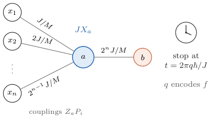

# Boolean Oracles by Waiting

Javier Blanco-Romero

Department of Telematic Engineering, Universidad Carlos III de Madrid, Leganés, Madrid, Spain

## Abstract

Can a fixed local Hamiltonian implement every Boolean oracle when only its stopping time is changed? We construct such a Hamiltonian on $n$ input qubits, one output qubit, and one auxiliary qubit. Its couplings have power-of-two denominators in a fixed energy unit, its spectral width is bounded, and its evolution approximates each oracle tensored with the auxiliary identity. For $n\ge3$, one auxiliary qubit is minimal: without it, universality by waiting requires interactions of order $n$. We then bound the number of Boolean functions evaluable within a budget of spectral width times duration. The bound includes independent heralded retries with no lower bound on success probability. For any fixed Hamiltonian, almost every truth table requires doubly exponential expected action, whereas controlled two-body evolution implements every oracle with single exponential action. Thus a compact physical device can realize every Boolean oracle, but selecting the computation through its duration has a large physical cost.

## Introduction

A Hamiltonian solver accepts an input, evolves, and returns an answer. The existence of such a solver and its cost within a physical resource budget are distinct questions. This distinction is familiar in analog computation \[[1](#ref-Bournez2021)\]. In quantum mechanics, energy alone does not bound computational speed \[[2](#ref-Jordan2017)\]; a bound depends on which physical resources and controls are available \[[3](#ref-Russell2017)\].

For a positive integer $n$, consider a Boolean function $f:\{0,1\}^n\to\{0,1\}$. Its quantum oracle acts as

$$
U_f\lvert x\rangle_{\mathrm{in}}\lvert \beta\rangle_b
 =\lvert x\rangle_{\mathrm{in}}\lvert \beta\oplus f(x)\rangle_b,\tag{1}
$$

where $x=(x_1,\ldots,x_n)$ is an input string, $\beta\in\{0,1\}$ is the output bit value, and $\oplus$ is addition modulo two. The subscript $b$ labels the output qubit; it is not a bit value. Since $U_f^2=\mathbf{1}$, with $\mathbf{1}$ the identity operator, the Hamiltonian $H_f=(\pi\hbar/2T)(\mathbf{1}-U_f)$ implements this oracle in any chosen duration $T>0$. Here $\hbar$ is the reduced Planck constant. Such function-dependent Hamiltonian representations are well established \[[4](#ref-Hadfield2021)\]. In this representation, the function is encoded in the interaction itself, which can involve the full register.

Known approaches to Hamiltonian computation \[[5](#ref-Feynman1986)\] select a computation through, for example, an encoded initial program \[[6](#ref-Bohdanowicz2017)\], controlled ancilla interactions \[[7](#ref-Proctor2013), [8](#ref-Proctor2014)\], local controls supplementing a fixed Hamiltonian \[[9](#ref-Junge2026)\], or a circuit-dependent impurity Hamiltonian \[[10](#ref-Pham2026)\]. Recurrence offers another mechanism: rationally independent frequencies can approach prescribed phases, as in universal quantum state transfer \[[11](#ref-Cameron2014)\]. The underlying number theory is classical \[[12](#ref-Besicovitch1940), [13](#ref-Weyl1916)\]. These precedents motivate a more restricted question: can one fixed two-body Hamiltonian approximate every Boolean oracle when only its duration changes, and what physical cost does this impose?

We answer this question with three results. First, we construct a fixed Hamiltonian with one auxiliary qubit, labeled $a$, whose evolution approximates $U_f\otimes\mathbf{1}_a$, where $\mathbf{1}_a$ is the identity on that auxiliary qubit. Thus the same device implements every oracle while approximately preserving any auxiliary state. Its couplings, expressed in a fixed energy unit, are dyadic rationals: integers divided by powers of two. Second, we prove the auxiliary-qubit threshold. Without auxiliary qubits, universality by waiting requires interaction order at least $n$ for $n\ge2$, and that order suffices. One auxiliary qubit is therefore minimal for a two-body device when $n\ge3$.

Third, we bound the number of Boolean functions accessible with a given expected action, defined as spectral width times duration divided by $\hbar$, summed over all attempts. We allow *heralding*: an additional measurement flags a run as accepted or rejected, and rejected runs are reset and repeated. The flag selects an accepted outcome; its output must still satisfy the prescribed error bound. Charging for discarded outcomes is an established operational principle \[[14](#ref-Combes2015)\]. Our counting bound permits acceptance probabilities arbitrarily close to zero. For any fixed Hamiltonian, it implies doubly exponential expected action for almost every truth table, meaning all but a vanishing fraction of the $2^{2^n}$ Boolean functions as $n$ grows.

The counting method builds on bounds for circuits and reachable quantum evolutions \[[15](#ref-Shannon1949), [16](#ref-Poulin2011), [17](#ref-Caro2022)\]; the additional step is a rescaling that handles arbitrarily rare acceptance. For comparison, standard two-body circuit synthesis implements every oracle with $O(n2^n)$ action and control intervals \[[18](#ref-Barenco1995)\], with sharper circuit bounds also available \[[19](#ref-Nie2026)\]. Combined with our lower bound, this gives a separation between programming by duration and programming through a sequence of controls. The result concerns typical truth tables, not an explicit hard function. It also differs from the no-programming theorem \[[20](#ref-Nielsen1997)\]: changing the duration changes the processor unitary, whereas that theorem varies the program state of a fixed processor. Our targets are commuting Boolean oracles.

## One fixed Hamiltonian

The device contains $n$ input qubits, one output qubit $b$, and one auxiliary qubit $a$. The $n$ inputs and the output form the logical register of $m=n+1$ qubits. Including the auxiliary, the Hilbert space is

$$
\mathcal H=\mathcal H_{\mathrm{in}}\otimes\mathcal H_b\otimes\mathcal H_a,
 \qquad \dim\mathcal H=2^{n+2},\tag{2}
$$

with $\mathcal H_{\mathrm{in}}=(\mathbb C^2)^{\otimes n}$ and $\mathcal H_b=\mathcal H_a=\mathbb C^2$. The input qubits have integer labels $i\in\{1,\ldots,n\}$; $a$ and $b$ are distinct labels for the auxiliary and output qubits.

We write operators without hats. The symbols $X,Y,Z$ denote the Pauli operators, and a subscript specifies the qubit on which they act. Identity factors on the other qubits are implicit. An identity with a subscript, such as $\mathbf{1}_a$, acts on the named register; without a subscript its space follows from the expression. The norm $\lVert \cdot\rVert$ is the operator norm for operators and the Euclidean norm for state vectors. A Pauli string is a tensor product of single-qubit Pauli operators and identities; its weight is the number of nonidentity factors. A Hamiltonian is $k$-local if it is a sum of terms supported on at most $k$ qubits. This bounds interaction order, not spatial range.

For any Hermitian Hamiltonian $H$, define its spectral width by

$$
W(H)=\lambda_{\max}(H)-\lambda_{\min}(H),\tag{3}
$$

where $\lambda_{\max}$ and $\lambda_{\min}$ are its largest and smallest eigenvalues. Evolution for time $t\ge0$ has dimensionless action $tW(H)/\hbar$. An additive scalar multiple of the identity changes only a global phase and leaves this action unchanged.

To construct the device, define the commuting logical projectors

$$
P_i=\tfrac12(\mathbf{1}-Z_i)\quad (i=1,\ldots,n),\qquad
 P_m=\tfrac12(\mathbf{1}-X_b).\tag{4}
$$

For an input qubit, $P_i$ projects onto $\lvert 1\rangle_i$. For the output, $P_m$ projects onto $\lvert -\rangle_b=(\lvert 0\rangle_b-\lvert 1\rangle_b)/\sqrt2$, the state that changes sign under a bit flip. Thus $i=m$ in a sum over projectors refers to the output projector, not to an additional input.

Set the integer $M=4^m$. Choose a positive real scalar $J$ with units of energy, fixing the overall energy scale, and take

$$
H_n=J\Bigl(X_a+\frac{Z_a}{M}\sum_{i=1}^{m}2^{i-1}P_i\Bigr).\tag{5}
$$

This operator acts on all $n+2$ qubits. Each term $Z_aP_i$ couples the auxiliary to a single logical qubit, giving the star in Fig. [1](#fig:device). The $O(n)$ coefficients of the dimensionless operator $H_n/J$ are dyadic rationals with $O(n^2)$ binary digits in total. They depend on $n$, but neither on $f$ nor on the requested accuracy. Multiplying $J$ by a constant simply rescales all evolution times by its inverse.

**Figure 1.** The fixed oracle device on $n+2$ qubits. The input node $i$ carries the bit $x_i$, $b$ is the output qubit, and $a$ is the auxiliary. A field $JX_a$ drives the auxiliary, which couples to each logical qubit through $Z_aP_i$ with strength $2^{i-1}J/M$. The couplings never change; the Boolean function is selected by the integer $q$ that fixes the stopping time.

**Theorem 1 (Universality by waiting).**  The Hamiltonian $H_n$ on $\mathcal H$ has spectral width $2J<W(H_n)<2J(1+4^{-m})$. For every Boolean function $f$ and every operator-norm tolerance $\eta>0$ there is a positive integer $q$ such that, at $t=2\pi q\hbar/J$,

$$
\lVert e^{-itH_n/\hbar}-U_f\otimes\mathbf{1}_a\rVert<\eta .\tag{6}
$$

The target $U_f\otimes\mathbf{1}_a$ acts as the oracle on the $n+1$ logical qubits and as the identity on the auxiliary qubit. The norm bound is uniform over all initial states, including states entangled with an external reference that does not interact with the device.

*Proof.* First resolve the logical register into sectors that remain invariant under $H_n$. The projectors $P_i$ are diagonal in the basis $\lvert x\rangle_{\mathrm{in}}\lvert \chi_y\rangle_b$, where $y\in\{0,1\}$ and $\lvert \chi_y\rangle=(\lvert 0\rangle+(-1)^y\lvert 1\rangle)/\sqrt2$ has $X_b$ eigenvalue $(-1)^y$. Label this basis by $z=(x,y)\in\{0,1\}^m$ and by the integer $s_z=\sum_i2^{i-1}z_i\in\{0,\dots,2^m-1\}$. Once $z$ is fixed, only the auxiliary qubit evolves. Its two-dimensional block is

$$
\begin{aligned}
 H_z&=J\Bigl(X+\frac{s_z}{M}Z\Bigr),\qquad H_z^2=J^2r_z^2\mathbf{1},\\
 r_z&=\frac{\sqrt{M^2+s_z^2}}{M},
 \end{aligned}\tag{7}
$$

where $r_z$ is a dimensionless frequency factor and $X,Z$ now act on the auxiliary. The eigenvalues of this block are $\pm Jr_z$ and $W(H_n)=2J\max_zr_z$. Since $s_z<2^m$, $1<\max_zr_z<1+4^{-m}$.

Next identify the phases that implement the oracle. It is diagonal in the same logical basis. A flip of the output multiplies $\lvert \chi_y\rangle$ by $(-1)^y$, so $U_f$ assigns the sign $(-1)^{g(z)}$ to sector $z$, with the Boolean phase function $g(x,y)=yf(x)$. At the all-zero label $z=0$, $g(0)=0$. At $t=2\pi q\hbar/J$ the block evolution is $\cos(2\pi qr_z)\mathbf{1}-i\sin(2\pi qr_z)H_z/(Jr_z)$, whose distance to $(-1)^{g(z)}\mathbf{1}$ is

$$
\lVert e^{-2\pi iqH_z/J}-(-1)^{g(z)}\mathbf{1}\rVert=2\bigl|\sin(e_z/2)\bigr| ,\tag{8}
$$

where $e_z\in(-\pi,\pi]$ is $2\pi qr_z-\pi g(z)$ reduced modulo $2\pi$. Both auxiliary eigenvalues give the same error, which is why the auxiliary state does not matter.

Finally, we show that one choice of time can align all these phases. The integers $M^2+s_z^2$ are distinct and lie in $[M^2,M^2+M)$, because $s_z^2<4^m=M$. The squarefree part of a positive integer is the integer left after removing all square factors. These integers have distinct squarefree parts: otherwise two would be $du^2<dv^2$, with the same squarefree integer $d$ and positive integers $u<v$, and since $\sqrt d\,u\ge M$ their gap would be $d(v^2-u^2)\ge2du+d\ge2M+1$, larger than the interval. Square roots with distinct squarefree parts are linearly independent over the rationals \[[12](#ref-Besicovitch1940)\], so $1=r_0$ and the remaining $r_z$ have no nonzero rational linear relation. Kronecker's theorem in its discrete form \[[13](#ref-Weyl1916), [11](#ref-Cameron2014)\] gives integers $q$ for which every $qr_z$ lies arbitrarily close to $g(z)/2$ modulo one, and $e_0=0$ always. Taking the maximum of Eq. [(8)](#eq:blockerror) over sectors proves Eq. [(6)](#eq:full), and tensoring with a reference identity does not change the norm.

The auxiliary supplies the nonlinear relation between the local field and the spectrum. The two-body field it sees is linear in $s_z$, but its dimensionless frequency factor is $r_z=\sqrt{1+(s_z/M)^2}$, and the resulting frequencies are rationally independent. Waiting then drives $2^m-1$ independent phases toward any pattern of signs.

## The auxiliary-qubit threshold

Could the logical register do the same alone? Only with interactions of order $n$.

**Proposition 2 (Locality threshold).**  Let $n\ge2$. There is a fixed $k$-local Hamiltonian on the $n+1$ logical qubits, with no auxiliary qubit, that approximates every oracle up to a global phase by varying the evolution time if and only if $k\ge n$. In particular, for $n\ge3$ one auxiliary qubit is necessary and sufficient for universality by waiting with two-body interactions.

*Proof.* We first show why interactions of order below $n$ cannot suffice. Every evolution generated by $H$ commutes with $H$. If such evolutions approach $U_f$ up to a global phase, then $U_f$ also commutes with $H$. Apply this to the function that is one at just one input string $x$. Its oracle is

$$
U_f=\mathbf{1}-2\lvert x,-\rangle\langle x,-\rvert,\qquad
 \lvert x,-\rangle=\lvert x\rangle_{\mathrm{in}}\lvert -\rangle_b.\tag{9}
$$

Commutation with this rank-one projector makes each $\lvert x,-\rangle$ an eigenvector of $H$. Write its eigenvalue as $h_x=\langle x,-\rvert H\lvert x,-\rangle$.

If $H$ is $k$-local, then $h_x$ is a polynomial of degree at most $k$ in the signs $(-1)^{x_i}$. To see this, expand $H$ in Pauli strings. An input factor $X_i$ or $Y_i$ has zero diagonal expectation in $\lvert x\rangle$, while $Z_i$ contributes $(-1)^{x_i}$. At most $k$ input factors can occur. For $k<n$, the coefficient of the product of all $n$ signs therefore vanishes:

$$
\sum_{x\in\{0,1\}^n}(-1)^{|x|}h_x=0,\tag{10}
$$

where $|x|=\sum_i x_i$ is the Hamming weight. Equivalently, the phases obey

$$
\prod_{x\in\{0,1\}^n}\bigl(e^{-ith_x/\hbar}\bigr)^{(-1)^{|x|}}=1\tag{11}
$$

at every time. This constraint survives limits. It is also unchanged by a common global phase because $\sum_x(-1)^{|x|}=0$. A single-string oracle has exactly one negative phase on these eigenvectors, so the product in Eq. [(11)](#eq:parity) is $-1$. This proves the obstruction.

For attainability, we construct an $n$-local Hamiltonian whose output-minus sector has independently tunable eigenvalues and whose output-plus sector has a common return time. Let $[n]=\{1,\ldots,n\}$. Choose real numbers $h_x$ and expand the diagonal input operator as

$$
\sum_xh_x\lvert x\rangle\langle x\rvert=\sum_{B\subseteq[n]}c_BZ_B,
 \qquad Z_B=\prod_{i\in B}Z_i,\tag{12}
$$

with $Z_\varnothing=\mathbf{1}$. Here $c_B$ are the real coefficients in the diagonal Pauli expansion. Define the output projectors $\Pi_\pm=(\mathbf{1}_b\pm X_b)/2$ and set

$$
\begin{aligned}
 H={}&\sum_{\substack{B\subseteq[n]\\ |B|<n}}c_BZ_B\otimes\Pi_-
       +c_{[n]}Z_{[n]}\otimes\mathbf{1}_b\\
     &+\kappa X_1\otimes\Pi_+,
 \end{aligned}\tag{13}
$$

where $\lambda>|c_{[n]}|$ is a positive energy and $\kappa=\sqrt{\lambda^2-c_{[n]}^2}$. Every term has weight at most $n$: the first sum has at most $n-1$ input factors plus the output, the parity term has $n$ input factors, and the final term is two-body.

On the output-minus sector, $H$ has eigenvalues $h_x$. On the output-plus sector it reduces to $c_{[n]}Z_{[n]}+\kappa X_1$. The two terms anticommute, so this block squares to $\lambda^2\mathbf{1}$. At times $t=2\pi q\hbar/\lambda$, for positive integers $q$, the plus sector returns exactly to the identity. Meanwhile, the minus sector acquires phases $e^{-2\pi iqh_x/\lambda}$.

Choose $1$ and all $h_x/\lambda$ rationally independent. For example, in fixed energy units take $h_x=\sqrt{\ell_x}$ for distinct primes $\ell_x$, then choose an integer $\lambda>|c_{[n]}|$. Kronecker's theorem makes the minus-sector phases approach any prescribed signs $(-1)^{f(x)}$, while the plus sector remains the identity. Thus $n$-local interactions suffice. For $n\ge3$, two-body locality lies below this threshold; Theorem [1](#thm:existence) shows that one auxiliary qubit suffices to overcome it.

One auxiliary qubit thus lowers the interaction order needed for universality by waiting from $n$ to two. The obstruction is a parity constraint, and the auxiliary qubit escapes it by making the sector frequencies nonlinear functions of a two-body field. The zero-auxiliary construction above also contains a hidden two-level system, the anticommuting pair on the $\Pi_+$ sector, but it pays for it with an $n$-body parity term.

## Recurrence density and first arrival

Theorem [1](#thm:existence) guarantees that good stopping times exist but says nothing about when they occur. For this device their frequency can be computed exactly.

**Proposition 3 (Frequency of good stopping times).**  Fix $f$ and $0<\eta<2$, and let $\varphi=2\arcsin(\eta/2)$. The positive integers $q$ for which Eq. [(6)](#eq:full) holds at $t=2\pi q\hbar/J$ have natural density

$$
\rho_\eta=\Bigl(\frac{\varphi}{\pi}\Bigr)^{2^{n+1}-1},\tag{14}
$$

the same for every Boolean function. Natural density means the limiting fraction of good integers among $1,\ldots,L$ as $L\to\infty$.

*Proof.* By Eq. [(8)](#eq:blockerror), Eq. [(6)](#eq:full) holds exactly when $|e_z|<\varphi$ for all $2^m-1$ sectors $z\ne0$, that is, when each $qr_z$ lies modulo one in an open interval of length $\varphi/\pi$ centered at $g(z)/2$. Since $1$ and the $r_z$ are rationally independent, Weyl's theorem \[[13](#ref-Weyl1916)\] makes the fractional parts $(qr_z\bmod1)_{z\ne0}$ uniformly distributed over the unit cube in $2^m-1$ dimensions. Intervals that cross an endpoint are read modulo one. The density of $q$ landing in a box equals its volume, $(\varphi/\pi)^{2^m-1}$, whatever the center of the box.

If $q_1<q_2<\cdots$ are the good integers, their positive density implies $q_j/j\to\rho_\eta^{-1}$. Hence the asymptotic average of the gaps $q_{j+1}-q_j$ is $\rho_\eta^{-1}$. For fixed $\eta$, this average grows doubly exponentially with $n$.

This is a long-run density statement, not a first-arrival estimate or a bound on the effort needed to find a suitable integer. For example, at $n=2$ and $\eta=0.1$, the identity oracle already satisfies Eq. [(6)](#eq:full) at $q=1$, with error approximately $0.03747$, although $\rho_\eta^{-1}\simeq3.01\times10^{10}$. Different oracles have equal recurrence density but can have very different first good times. The lower bound on the time needed for most functions will instead follow from a separate counting argument.

## Expected action and the number of accessible functions

The construction shows that every oracle can eventually be reached. We now ask how many functions any device can evaluate within a fixed physical budget. The key observation is that nearby choices of Hamiltonians and durations produce nearby states, whereas two different Boolean functions must give distinguishable answers on at least one input. A finite budget therefore limits how many distinct answers can fit into the available control space. Heralding complicates this argument because the accepted part of the state can be arbitrarily small; accounting for repeated attempts restores a bound.

The model allows more auxiliaries than the single qubit $a$ used in the construction. Fix a total of $N\ge n+1$ qubits, split into the input register, the output qubit $b$, a work register $\mathrm w$, and a flag register $\mathrm h$. The last two contain $N_{\mathrm w}$ and $N_{\mathrm h}$ qubits, respectively, with $N_{\mathrm w}+N_{\mathrm h}=N-n-1$. Either may be empty. Each run starts in

$$
\lvert \psi_x\rangle=\lvert x\rangle_{\mathrm{in}}\lvert 0\rangle_b
              \lvert 0^{N_{\mathrm w}}\rangle_{\mathrm w}
              \lvert 0^{N_{\mathrm h}}\rangle_{\mathrm h}.\tag{15}
$$

The notation $\lvert 0^r\rangle$ means $r$ qubits initialized to zero. A fixed projector $P_{\mathrm h}$ on the flag register specifies the accepted measurement outcome. Its action on the full device is

$$
\Pi=\mathbf{1}_{\mathrm{in}}\otimes\mathbf{1}_b\otimes\mathbf{1}_{\mathrm w}\otimes P_{\mathrm h}.\tag{16}
$$

For example, one flag qubit can signal acceptance by ending in $\lvert 1\rangle$, with $P_{\mathrm h}=\lvert 1\rangle\langle 1\rvert$. Taking $\Pi=\mathbf{1}$ gives a procedure that always accepts and needs no flag qubits. The work qubits may be discarded at the end. The output is read in the computational basis after acceptance. Preparation, register labels, and both measurements are fixed for all functions.

Fix a locality order $k\ge1$ and a positive integer $S$, the maximum number of successive constant-Hamiltonian intervals in a run. For $j=1,\ldots,S$, let $H_j$ be a $k$-local Hamiltonian acting for a time $t_j\ge0$. Zero durations allow fewer than $S$ intervals. The evolution $U$ and its dimensionless run action $A$ are

$$
U=e^{-it_SH_S/\hbar}\cdots e^{-it_1H_1/\hbar},\qquad
 A=\sum_{j=1}^{S}t_jW(H_j)/\hbar.\tag{17}
$$

The times and couplings may depend on $f$, but not on the input $x$. The success probability is $p_x=\lVert \Pi U\lvert \psi_x\rangle\rVert^2>0$. Conditioned on success, the normalized state is $\Pi U\lvert \psi_x\rangle/\sqrt{p_x}$, and measuring $b$ must return $f(x)$ with error probability at most $\epsilon$, where $0\le\epsilon<1/2$. This classical-output requirement is weaker than coherent oracle implementation, so a lower bound here also applies to the construction.

Independent repetitions until acceptance take $1/p_x$ runs on average. Their worst-case expected action is therefore

$$
C=\max_x\frac{A}{p_x}.\tag{18}
$$

We count resets and readout as free; charging for them can only increase the cost \[[14](#ref-Combes2015)\]. For a budget $R\ge0$, let $\mathcal F(R)$ be the set of functions admitting an implementation with $C\le R$. Write $\delta=1-2\epsilon>0$ for the required output bias. Finally, define

$$
K(N,k)=\sum_{r=1}^{\min(k,N)}3^r\binom Nr.\tag{19}
$$

This counts the nonidentity Pauli strings of weight at most $k$: choose the $r$ qubits, then one of $X,Y,Z$ on each. Thus one $k$-local generator has $K(N,k)$ real coefficients after removing its scalar identity term, and $S$ intervals have $d=K(N,k)S$ coefficients.

**Theorem 4 (Capacity).**  For fixed $N,k,S,\epsilon$ in the model above,

$$
|\mathcal F(R)|\le\Bigl(1+\frac{2R}{\delta}\Bigr)^{d},\qquad d=K(N,k)\,S .\tag{20}
$$

The bound holds even when success probabilities approach zero. If the allowed generator tuples lie in a real linear space of dimension $d'$ modulo scalars, $d$ may be replaced by $d'$.

*Proof.* *Describe the controls.* Adding a scalar to a Hamiltonian changes only a global phase, so write $[Q]$ for a Hermitian operator $Q$ with such scalar shifts identified. A run is represented by its integrated generators

$$
G=([t_jH_j/\hbar])_{j=1}^S.\tag{21}
$$

Their real parameter space has dimension $d$. Give it the norm

$$
\lVert G\rVert_*=\sum_{j=1}^S\inf_{c\in\mathbb R}\lVert t_jH_j/\hbar-c\mathbf{1}\rVert=A/2.\tag{22}
$$

The equality follows by centering each spectrum between its largest and smallest eigenvalues. If $R=0$, or the allowed space has dimension zero, the evolution is fixed up to phase and at most one function is possible. Assume otherwise. Let $U_G$ denote the evolution specified by $G$. For two runs $G,G'$, Duhamel's formula bounds the difference of each interval's evolutions by the difference of its integrated generators. Adding these bounds over the ordered product gives

$$
\inf_{\theta\in\mathbb R}\lVert U_G-e^{i\theta}U_{G'}\rVert\le\lVert G-G'\rVert_*.\tag{23}
$$

*Separate different answers.* Choose two distinct functions and one implementation of each, with actions $A,A'$. They differ on some input $x$. The unnormalized accepted states are $u=\Pi U_G\lvert \psi_x\rangle$ and $v=\Pi U_{G'}\lvert \psi_x\rangle$, with probabilities $p=\lVert u\rVert^2$ and $p'=\lVert v\rVert^2$. The output observable $Z_b$ commutes with $\Pi$, since the output and flag occupy different qubits. Conditional correctness gives $\langle u\rvert Z_b\lvert u\rangle$ and $\langle v\rvert Z_b\lvert v\rangle$ opposite signs, with magnitudes at least $\delta p$ and $\delta p'$. For every phase $\theta$,

$$
\begin{aligned}
 \delta(p+p')&\le\bigl|\langle u\rvert Z_b\lvert u\rangle-\langle v\rvert Z_b\lvert v\rangle\bigr|\\
 &\le(\sqrt p+\sqrt{p'})\lVert u-e^{i\theta}v\rVert.
 \end{aligned}\tag{24}
$$

The last step expands the difference of the two quadratic forms and uses $\lVert Z_b\rVert=1$. Projection cannot increase norm, so Eq. [(23)](#eq:control-distance) also bounds the distance between these accepted states. Moreover, $C\le R$ implies $p\ge A/R$ and $p'\ge A'/R$. Using $(\sqrt p+\sqrt{p'})^2\le2(p+p')$ gives

$$
\lVert G-G'\rVert_*\ge\delta\sqrt{(A+A')/(2R)}.\tag{25}
$$

*Include rare acceptance.* The separation in Eq. [(25)](#eq:run-separation) becomes small when the runs have small action. Rescale each point to $V=G/\sqrt A$, taking $V=0$ for $A=0$. Put $\alpha=\sqrt A\ge\alpha'=\sqrt{A'}$. Since $\lVert V\rVert_*=\alpha/2$ and $\lVert V'\rVert_*=\alpha'/2$, the reverse triangle inequality gives $\alpha-\alpha'\le2\lVert V-V'\rVert_*$. Hence

$$
\begin{aligned}
 \lVert G-G'\rVert_*&=\lVert \alpha(V-V')+(\alpha-\alpha')V'\rVert_*\\
 &\le\alpha\lVert V-V'\rVert_*+(\alpha-\alpha')\alpha'/2\\
 &\le(\alpha+\alpha')\lVert V-V'\rVert_*.
 \end{aligned}\tag{26}
$$

Combining this with Eq. [(25)](#eq:run-separation) and $\alpha+\alpha'\le\sqrt{2(A+A')}$ shows that different functions give rescaled points at least $\delta/(2\sqrt R)$ apart. Two distinct functions cannot both have zero action. Since $p_x\le1$, the budget also gives $A\le R$, so every rescaled point satisfies $\lVert V\rVert_*\le\sqrt R/2$.

*Count the points.* Select one such point per function and surround it by an open ball of radius $\delta/(4\sqrt R)$ in the norm $\lVert \cdot\rVert_*$. The separation makes these balls disjoint. They all fit inside the ball of radius $\sqrt R/2+\delta/(4\sqrt R)$ centered at the origin. In a $d$-dimensional normed space, ball volume scales as the $d$th power of radius. Comparing these volumes gives $(1+2R/\delta)^d$, as claimed. The same argument takes place in dimension $d'$ when the allowed tuples lie in that smaller linear space.

The rescaling by $\sqrt A$ is what lets the bound tolerate success probabilities that approach zero: a cheap run must succeed often enough to fit the budget, and a rare success must be paid for with retries. Adaptive reuse of failed states is a different model, not covered here.

**Corollary 5 (A fixed Hamiltonian).**  If $H$ is fixed and only its nonnegative duration depends on $f$, then, under the same preparation, readout and retry rules, at most $1+R/\delta$ functions are evaluable with expected action at most $R$, whatever the dimension or locality of $H$. Consequently all but a fraction $2^{-2^{n-1}}$ of Boolean functions require

$$
C>\delta\bigl(2^{2^{n-1}}-1\bigr) .\tag{27}
$$

*Proof.* If $W(H)=0$, the evolution is scalar and at most one function is possible. Otherwise, varying only the nonnegative duration makes all integrated generators proportional to the same fixed operator. The rescaled tuples therefore lie on one ray at distances $\sqrt A/2\in[0,\sqrt R/2]$ from the origin and are at least $\delta/(2\sqrt R)$ apart, so there are at most $1+R/\delta$ of them. Setting $R=\delta(2^{2^{n-1}}-1)$ allows at most $2^{2^{n-1}}$ of the $2^{2^n}$ functions.

For the construction, an operator-norm error $\eta$ gives decision error at most $\eta^2$: the ideal output has no amplitude in the wrong-output subspace. Thus any fixed $0<\eta<1/\sqrt2$ permits application of Corollary [5](#cor:fixed) with $\epsilon=\eta^2$ and no heralding. Since $W(H_n)/J$ is bounded above and below, almost every oracle needs a doubly exponential physical waiting time in units $\hbar/J$. This conclusion holds at all nonnegative times, not only at the integer sampling times of Proposition [3](#prop:density). It does not supply a matching first-arrival upper bound.

The bound also says where the program can be stored. Its logarithm reads $\log_2|\mathcal F(R)|\le d\log_2(1+2R/\delta)$, so a scheme with $d$ real control parameters and budget $R$ can address at most $d\log_2(1+2R/\delta)$ bits of truth table.

**Corollary 6 (Action and control intervals).**  Fix $N,k,S$ and $0\le\epsilon<1/2$, with the preparation and readout of Theorem [4](#thm:capacity). All but a fraction $2^{-2^{n-1}}$ of Boolean functions have the following property: every implementation using at most $S$ intervals has expected action $C$ satisfying

$$
K(N,k)\,S\,\log_2\Bigl(1+\frac{2C}{\delta}\Bigr)>2^{n-1}.\tag{28}
$$

The exceptional set may depend on these fixed parameters. Conversely, controlled two-body evolution implements every oracle exactly, up to a global phase, with $O(n2^n)$ intervals and action, without auxiliary qubits.

*Proof.* Set $R=(\delta/2)(2^{2^{n-1}/[K(N,k)S]}-1)$ in Theorem [4](#thm:capacity). At most $2^{2^{n-1}}$ functions admit an implementation with $C\le R$, proving Eq. [(28)](#eq:exchange).

For the upper bound, change the output to its $X$ basis. The oracle is then diagonal with signs $(-1)^{g(z)}$. Use the phase function $g(x,y)=yf(x)$ defined in Sec. [2](#sec:existence), with $z=(x,y)\in\{0,1\}^m$. For each subset $B\subseteq\{1,\ldots,m\}$, the Walsh character $w_B(z)=\prod_{i\in B}(-1)^{z_i}$ is a product of bit signs. The Walsh expansion is the Fourier expansion on bit strings, with coefficients $\widehat g_B$ given by

$$
\begin{aligned}
 \widehat g_B&=2^{-m}\sum_zg(z)w_B(z),\\
 (-1)^{g(z)}&=\prod_Be^{-i\pi\widehat g_Bw_B(z)}.
 \end{aligned}\tag{29}
$$

Here the hat denotes a scalar Fourier coefficient, not an operator. In the computational basis after the output basis change, let $Z_B=\prod_{i\in B}Z_i$, where index $m$ denotes the output. Each nonempty $B$ gives a rotation $e^{-i\pi\widehat g_BZ_B}$. A chain of controlled-NOT gates computes the parity on one qubit; a single-qubit rotation and the reverse chain implement the rotation \[[18](#ref-Barenco1995)\]. This uses $O(m)$ one- and two-qubit gates per subset and no scratch qubits. The empty subset contributes only a global phase. Each gate has a Hermitian logarithm of spectral width at most $2\pi$ and hence costs at most $2\pi$ action. Summing over $2^m$ subsets and including the output basis changes gives $O(n2^n)$ intervals and action.

For fixed error and $N=n+2$, two-body interactions have $K(N,2)=O(n^2)$. With $S=1$, Eq. [(28)](#eq:exchange) gives $C=2^{\Omega(2^n/n^2)}$ for almost every function, even if the constant Hamiltonian is chosen separately for each function. A single fixed Hamiltonian has only its duration available and obeys the stronger Corollary [5](#cor:fixed).

For comparison, fix any budget $R(n)\le2^{cn}$ with constant $c>0$. The fraction of functions attainable with at most $S(n)$ intervals is bounded by

$$
\frac{\bigl(1+2R(n)/\delta\bigr)^{K(N,2)S(n)}}{2^{2^n}}.\tag{30}
$$

Consequently, achieving this action budget for even half of all truth tables requires $S(n)=\Omega(2^n/n^3)$. The elementary controlled construction is within polynomial factors of this interval count; sharper oracle synthesis is available \[[19](#ref-Nie2026)\]. The logarithm of Eq. [(20)](#eq:capacity) expresses the common principle: accessible truth tables are limited jointly by the number of real control parameters and the logarithm of the action budget.

## Precision

Long waits also demand precise devices. Let $H$ be the ideal Hamiltonian, such as $H_n$, and let $E$ be a Hermitian error in the Hamiltonian and $\Delta t$ an error in the stopping time. If the ideal evolution approximates $U_f\otimes\mathbf{1}_a$ within $\eta$, Duhamel's formula bounds the actual error, up to a global phase, by

$$
\eta+\frac{t}{\hbar}\inf_{c\in\mathbb R}\lVert E-c\mathbf{1}\rVert+\frac{|\Delta t|}{2\hbar}W(H+E) .\tag{31}
$$

This gives a sufficient worst-case calibration condition, not a necessary error tolerance for every perturbation. For a fixed additional error allowance $\xi$, it suffices to make the centered Hamiltonian error $O(\hbar\xi/t)$ and the timing error $O(\hbar\xi/W(H+E))$. In relative units the required coupling precision therefore scales as $\xi/(tJ/\hbar)$, corresponding to $O(\log_2(tJ/\hbar)+\log_2(1/\xi))$ binary digits. Absolute clock resolution can stay constant at fixed width and accuracy; the range of times the clock must represent grows with $t$. These are distinct requirements. Equidistribution alone gives no upper bound on either requirement for the first implementation of a chosen oracle.

## Conclusion

A fixed rational two-body Hamiltonian approximates every Boolean oracle using one auxiliary qubit. For $n\ge3$, the auxiliary qubit is necessary under two-body locality. The device is compact, but the duration is its program: for any fixed Hamiltonian, almost every truth table requires doubly exponential expected action. Independent heralded retries cannot remove this cost, even when success probabilities approach zero. Allowing a sequence of two-body controls reduces the action needed for every oracle to a single exponential upper bound. The distinction is therefore between realizing a computation and providing an efficient physical way to select it.

The scope of the result is specific. Interaction order is bounded, but the star has unbounded degree and imposes no spatial propagation constraint. The stopping clock is external. Failed runs are reset, and adaptive reuse of failed states is outside the capacity theorem. The lower bounds concern almost all truth tables at each input size, rather than an explicit family. Natural next questions are quantitative first-arrival bounds for the construction, bounded-degree realizations, and expected-action bounds for adaptive protocols. Establishing a comparable obstruction for an explicit, efficiently described function family would require additional structure beyond counting.

##### Data availability.

The accompanying code runs the finite numerical checks and records their outputs.

## AI assistance

The research vision and original ideas are the author's. The author used OpenAI's GPT models, including Astra, and Anthropic's Claude Opus models for writing, theorem proving, and literature review. GPT models were used most often, and Astra was the most useful overall. This work is in progress. Not all claims have been verified by a human.

## References

\[1\]

Olivier Bournez and Amaury Pouly. A Survey on Analog Models of Computation. In Vasco Brattka and Peter Hertling, editors, *Handbook of Computability and Complexity in Analysis*, Theory and Applications of Computability, pages 173–226. Springer, Cham, 2021.

\[2\]

Stephen P. Jordan. Fast quantum computation at arbitrarily low energy. *Physical Review A*, 95(3):032305, 2017.

\[3\]

Benjamin Russell and Susan Stepney. The Geometry of Speed Limiting Resources in Physical Models of Computation. *International Journal of Foundations of Computer Science*, 28(4):321–333, 2017.

\[4\]

Stuart Hadfield. On the Representation of Boolean and Real Functions as Hamiltonians for Quantum Computing. *ACM Transactions on Quantum Computing*, 2(4):1–21, 2021. Article 18.

\[5\]

Richard P. Feynman. Quantum mechanical computers. *Foundations of Physics*, 16(6):507–531, 1986.

\[6\]

Thomas C. Bohdanowicz and Fernando G. S. L. Brandão. Universal Hamiltonians for Exponentially Long Simulation, 2017.

\[7\]

Timothy J. Proctor, Erika Andersson, and Viv Kendon. Universal quantum computation by the unitary control of ancilla qubits and using a fixed ancilla-register interaction. *Physical Review A*, 88(4):042330, 2013.

\[8\]

Timothy J Proctor and Viv Kendon. Minimal ancilla mediated quantum computation. *EPJ Quantum Technology*, 1(1):13, 2014.

\[9\]

Marius Junge, Jason Pollack, and Luke Visser. Universal computation with magic Hamiltonians, 2026.

\[10\]

N. C. Mai Pham and Raul A. Santos. Time evolution of impurity models and their universality for quantum computation, 2026.

\[11\]

Stephen Cameron, Shannon Fehrenbach, Leah Granger, Oliver Hennigh, Sunrose Shrestha, and Christino Tamon. Universal state transfer on graphs. *Linear Algebra and its Applications*, 455:115–142, 2014.

\[12\]

A. S. Besicovitch. On the Linear Independence of Fractional Powers of Integers. *Journal of the London Mathematical Society*, s1-15(1):3–6, 1940.

\[13\]

Hermann Weyl. Über die Gleichverteilung von Zahlen mod. Eins. *Mathematische Annalen*, 77(3):313–352, 1916.

\[14\]

Joshua Combes and Christopher Ferrie. Cost of postselection in decision theory. *Physical Review A*, 92(2):022117, 2015.

\[15\]

Claude E. Shannon. The Synthesis of Two-Terminal Switching Circuits. *Bell System Technical Journal*, 28(1):59–98, 1949.

\[16\]

David Poulin, Angie Qarry, Rolando Somma, and Frank Verstraete. Quantum Simulation of Time-Dependent Hamiltonians and the Convenient Illusion of Hilbert Space. *Physical Review Letters*, 106(17):170501, 2011.

\[17\]

Matthias C. Caro, Hsin-Yuan Huang, M. Cerezo, Kunal Sharma, Andrew Sornborger, Lukasz Cincio, and Patrick J. Coles. Generalization in quantum machine learning from few training data. *Nature Communications*, 13(1):4919, 2022.

\[18\]

Adriano Barenco, Charles H. Bennett, Richard Cleve, David P. DiVincenzo, Norman Margolus, Peter Shor, Tycho Sleator, John A. Smolin, and Harald Weinfurter. Elementary gates for quantum computation. *Physical Review A*, 52(5):3457–3467, 1995.

\[19\]

Junhong Nie and Wei Zi. Nearly optimal quantum circuits for Boolean oracles, 2026.

\[20\]

M. A. Nielsen and Isaac L. Chuang. Programmable Quantum Gate Arrays. *Physical Review Letters*, 79(2):321–324, 1997.
