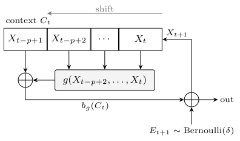
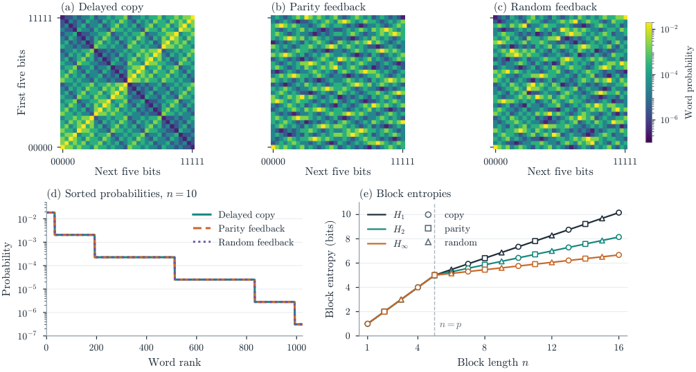
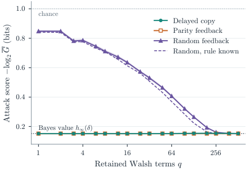
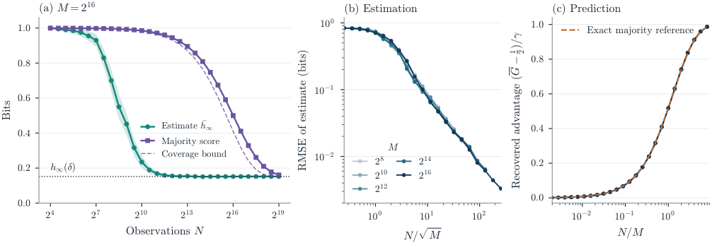

# Identical Entropy Profiles, Different Prediction Costs

Javier Blanco-Romero

Department of Telematic Engineering, Universidad Carlos III de Madrid, Leganés, Madrid, Spain

## Abstract

Min-entropy fixes the probability of the best guess, but not the cost of computing it. We exhibit a stationary binary source family in which the complete block probability spectrum, the statistical complexity, and the excess entropy are independent of the feedback rule. At fixed memory $p$ and noise level, the next-bit decision can nevertheless range from a single wire to $\Theta(2^p/p)$ Boolean gates, even for a fixed positive fraction of the optimal prediction advantage. Invertible feedback preserves the probability spectrum while changing which continuation is most likely. A companion result separates estimation from learning: for an unknown noisy table on $M$ independent uniform contexts, conditional min-entropy estimation requires $\Theta(\sqrt M)$ samples at fixed precision, while useful prediction requires $\Theta(M)$. Exact enumeration and simulations illustrate both separations. The stationary family provides a known entropy target for testing predictors: failure to approach that target can reflect computational cost rather than source uncertainty.

## Introduction

An entropy value says how well an ideal observer can guess. A prediction algorithm must also discover which guess to make. When the algorithm fails, its error mixes uncertainty in the source with limitations of the algorithm. This distinction is central to predictor-based assessments of random number generators \[[1](#ref-kelsey2015predictive), [2](#ref-sonmez2018recommendation)\], including those using machine learning \[[3](#ref-blanco2025machine)\], and it is the reason computational notions of entropy are defined through bounded predictors or distinguishers \[[4](#ref-yao1982theory), [5](#ref-barak2003computational), [6](#ref-hsiao2007conditional)\]. A successful prediction exposes regularity; failure to predict does not, by itself, establish randomness.

There is a simple reason to expect a gap. Entropy depends on the probabilities of outcomes, but not on their names. Rearranging the probabilities leaves entropy unchanged, although finding the most likely outcome may become harder. For a sequence, however, an arbitrary rearrangement need not define a stationary process. We use invertible feedback to make such a rearrangement consistent at every time and every block length.

The resulting sources share their complete block probability spectra and the information stored in their predictive states, measured by statistical complexity \[[7](#ref-crutchfield1989inferring), [8](#ref-shalizi2001computational)\] and excess entropy \[[9](#ref-grassberger1986toward), [10](#ref-crutchfield2003regularities), [11](#ref-bialek2001predictability)\]. Their next-bit rules nevertheless range from a wire to circuits of exponential size (Theorems [1](#thm:profile) and [2](#thm:hardness)). The feedback form is classical \[[12](#ref-golomb2014shift), [13](#ref-dabrowski2014searching)\], as is the counting argument behind the circuit bound \[[14](#ref-shannon1949synthesis), [15](#ref-jukna2012boolean)\]. Combining them gives an exactly solvable example of what entropy and predictive memory leave undetermined. Calibrated stochastic sources already provide benchmarks with known optimal prediction error \[[16](#ref-marzen2024benchmarks)\]. Here the full predictive context is supplied, and the entire probability spectrum is held fixed while the decision cost varies.

The distinction persists when the source law must be learned. Estimating the best achievable performance can require fewer observations than learning a predictor that achieves it, as shown by Kong and Valiant \[[17](#ref-kong2018learnability)\]. We give a finite-alphabet instance for conditional min-entropy (Proposition [1](#prop:samples)): repeated contexts reveal the noise level well before enough contexts have been observed to support prediction. This calculation supplies a statistical counterpart to the stationary construction and a direct comparison for entropy-estimation experiments.

## Changing the rule without changing the entropy

Let $X_t\in\{0,1\}$ be the bit emitted at integer time $t$. Write $X_a^b=(X_a,\ldots,X_b)$ for a block, and let $\oplus$ denote addition modulo two. Fix a memory length $p\ge2$, a noise probability $0<\delta<1/2$, and a Boolean feedback function $g:\{0,1\}^{p-1}\to\{0,1\}$. Starting from a uniform initial block $X_1^p$, draw each noise bit $E_{t+1}$ independently of the past, with probability $\delta$ of one. The source obeys

$$
X_{t+1}=X_{t-p+1}\oplus g(X_{t-p+2},\ldots,X_t)\oplus E_{t+1},
\qquad t\ge p .\tag{1}
$$

Figure [1](#fig:register) shows the corresponding register. The current context is $C_t=X_{t-p+1}^t$. For a possible context $c=(c_1,\ldots,c_p)$, define its preferred output $b_g(c)$ and noiseless successor $T_g(c)$ by

$$
b_g(c)=c_1\oplus g(c_2,\ldots,c_p),\qquad
T_g(c)=(c_2,\ldots,c_p,b_g(c)).\tag{2}
$$

The map $T_g$ is a permutation: its image retains the suffix, and the last output recovers the discarded bit. This is the nonsingular feedback form of shift-register theory \[[12](#ref-golomb2014shift), [13](#ref-dabrowski2014searching)\]. The term $g$ can be arbitrarily complicated without losing invertibility.

Logarithms are base two unless written as $\ln$. A finite variable $W$ with probabilities $q_w=\mathbb{P}(W=w)$ has Rényi entropy of order $\alpha$:

$$
H_\alpha(W)=\frac{1}{1-\alpha}\log\sum_w q_w^\alpha,
\qquad 0<\alpha<\infty,\quad\alpha\ne1.\tag{3}
$$

The limits $\alpha\to1$, $\alpha\to\infty$, and $\alpha\to0$ give the Shannon entropy $H_1(W)=-\sum_w q_w\log q_w$, the min-entropy $H_\infty(W)=-\log\max_w q_w$, and the logarithm $H_0$ of the support size \[[18](#ref-renyi1961measures)\]. Write $h_\alpha(\delta)$ for the Rényi entropy of a Bernoulli variable with parameter $\delta$.

To measure predictive memory, identify two pasts when they induce the same law of the entire future. The resulting equivalence class is the *causal state*; its Shannon entropy, denoted by $C_\mu$, is the statistical complexity of computational mechanics \[[7](#ref-crutchfield1989inferring), [8](#ref-shalizi2001computational)\]. The *excess entropy* $\mathcal E$ is the mutual information between the infinite past and future \[[9](#ref-grassberger1986toward), [10](#ref-crutchfield2003regularities), [11](#ref-bialek2001predictability)\]. These quantities are understood in the two-sided stationary extension of the source; $I(\cdot;\cdot)$ below denotes mutual information.

**Figure 1.** Noisy nonsingular feedback register, Eq. [(1)](#eq:source). The oldest bit enters the output linearly, so the noiseless update $T_g$ is invertible for every feedback function $g$. The preferred output $b_g(C_t)$ is the Bayes decision for the next bit.

**Theorem 1 (Common entropy profile).**  For every feedback rule $g$, the context chain is irreducible and aperiodic, with the uniform stationary distribution on $\{0,1\}^p$. At block length $n\le p$, every word has probability $2^{-n}$. At length $n\ge p$, words with $j$ nonzero noise bits after the initial context have probability and multiplicity

$$
2^{-p}\delta^j(1-\delta)^{n-p-j},
\qquad
2^p\binom{n-p}{j},
\qquad j=0,\ldots,n-p.\tag{4}
$$

Consequently, for every order $\alpha\in[0,\infty]$,

$$
H_\alpha(X_1^n)=\min(n,p)+\max(n-p,0)\,h_\alpha(\delta).\tag{5}
$$

All $2^p$ contexts are distinct causal states, and

$$
C_\mu=p,\qquad
\mathcal E=I(X_{-\infty}^{0};X_1^\infty)=p[1-h_1(\delta)].\tag{6}
$$

*Proof.* Both possible next bits have positive probability, so any context reaches any other in $p$ steps. The all-zero context has a self-loop. For a destination $(u,y)$, where $u\in\{0,1\}^{p-1}$ is a suffix and $y\in\{0,1\}$ is the appended bit, the predecessors are $(0,u)$ and $(1,u)$. Their preferred outputs are opposite. The two incoming transition probabilities therefore sum to one, and the uniform context law is stationary.

Every word $x_1^n$ with $n\ge p$ determines its initial context and its realized noise bits through

$$
e_{t+1}=x_{t+1}\oplus x_{t-p+1}\oplus g(x_{t-p+2},\ldots,x_t),
\qquad p\le t<n.
$$

 Conversely, that context and those noise bits determine the word. There are $2^p$ initial contexts and $\binom{n-p}{j}$ noise strings with $j$ ones. This bijection proves Eq. [(4)](#eq:spectrum). Summing powers of the probabilities gives Eq. [(5)](#eq:profile); shorter words are marginals of the uniform context.

Given a context $c$, the unique most likely next $p$ bits are the continuation with no noise, of probability $(1-\delta)^p$. This word equals $T_g^p(c)$, the state reached after $p$ noiseless updates. Since $T_g^p$ is a permutation, distinct contexts have distinct modal future words and hence distinct future laws. Thus the contexts are exactly the causal states, and their uniformity gives $C_\mu=p$. Conditional on the past, each new bit has Shannon entropy $h_1(\delta)$. It follows that

$$
I(X_{-\infty}^{0};X_1^n)=H_1(X_1^n)-n h_1(\delta).
$$

 Taking the limit in Eq. [(5)](#eq:profile) gives Eq. [(6)](#eq:memory).

Changing $g$ changes which words carry the large probabilities while leaving the list of probabilities intact. Figure [2](#fig:profiles) displays this rearrangement for delayed copy ($g=0$), parity of three suffix bits, and a random feedback table. Direct enumeration through length 16 agrees with Eq. [(5)](#eq:profile) to within $5.3e-15$ bits. For all 276 rules with $2\le p\le4$, independent checks confirm Eq. [(4)](#eq:spectrum) in exact rational arithmetic, the distinctness of the $2^p$ future laws, and Eq. [(6)](#eq:memory) to within $3\times10^{-14}$ bits.

**Figure 2.** The probabilities move; their spectrum does not. For memory $p=5$ and noise $\delta=0.1$, panels (a)–(c) show the probabilities of ten-bit words under three feedback rules. Rows index the first five bits and columns the next five. (d) Sorting the 1024 probabilities gives coincident curves. (e) Block Rényi entropies: lines are Eq. [(5)](#eq:profile), and open markers are independent enumerations of the three sources, interleaved so that coincident points remain visible.

The same construction connects finite windows to asymptotic min-entropy. For a future length $n$, the most likely continuation from any known context follows the preferred edges and has probability $(1-\delta)^n$. In the context graph, weight each edge by minus the logarithm of its transition probability. No edge has weight below $-\log(1-\delta)$, and the preferred edges form permutation cycles attaining this weight. Thus the minimum mean-cycle value, used in context-graph analyses of min-entropy asymptotics \[[19](#ref-blanco2026contextgraphs)\], equals the block min-entropy rate:

$$
\lim_{n\to\infty}\frac{H_\infty(X_1^n)}{n}=h_\infty(\delta)=-\log(1-\delta).\tag{7}
$$

Nevertheless, every window of at most $p$ bits is uniform. This is the short-window phenomenon of the two-faced processes of Ryabko and Monarev \[[20](#ref-ryabko2005testing)\]; it is not peculiar to the present construction. Here it coexists with an arbitrary feedback rule. A predictor restricted to fewer than $p$ immediately preceding bits has success exactly $1/2$, whatever that rule is.

## The cost of the best guess

Let $C$ be a stationary context and $Y$ its next bit. A deterministic predictor $f:\{0,1\}^p\to\{0,1\}$ has success probability $G(f)=\mathbb{P}(f(C)=Y)$. The Bayes rule is $b_g$, whose optimal success $G^\star$ determines the average conditional min-entropy \[[21](#ref-dodis2004fuzzy), [22](#ref-konig2009operational)\]:

$$
\begin{aligned}
G^\star&=\mathbb{E}_C\max_{y\in\{0,1\}}\mathbb{P}(Y=y\mid C)=1-\delta,\\
\widetilde H_\infty(Y\mid C)&=-\log G^\star=h_\infty(\delta).
\end{aligned}\tag{8}
$$

Because the conditional guessing probability is the same for every context, the average and worst-case conditional min-entropies coincide here. We call $-\log G(f)$ the predictor's *attack score*. It is at least the ideal value in Eq. [(8)](#eq:guessing). This direction of the inequality is why a poor predictor cannot certify high source entropy.

Put $\gamma=G^\star-1/2=1/2-\delta$, the Bayes advantage over a fair guess. A target fraction $0<\rho\le1$ of this advantage means success at least $1/2+\rho\gamma$. Fix a functionally complete finite Boolean gate basis of fan-in at most two, and let $\mathsf{size}(f)$ be the smallest number of gates computing $f$. Define

$$
K_g(\rho)=\min\{\mathsf{size}(f):G(f)\ge1/2+\rho\gamma\}.\tag{9}
$$

The $p$ context bits are supplied as inputs; lookup tables must be implemented by gates. For a gate budget $s$, the associated bounded-guessing entropy $-\log\sup_{\mathsf{size}(f)\le s}G(f)$ is an instance of unpredictability entropy \[[6](#ref-hsiao2007conditional)\]. Restricted prediction also underlies usable information \[[23](#ref-xu2020usable)\], which uses logarithmic loss. Our question is how far ordinary circuit cost can vary within the common entropy profile of Theorem [1](#thm:profile).

When $g=0$, the decision reads the oldest bit, so one wire suffices. Parity feedback needs only linearly many gates. For most feedback tables, even an approximate decision requires exponentially many.

**Theorem 2 (Decision cost at fixed entropy).**  Draw $g$ uniformly from all Boolean functions on $p-1$ bits. There is a constant $a\ge1$, depending only on the gate basis, such that for every integer gate budget $s\ge p$,

$$
\mathbb{P}_g[K_g(\rho)\le s]
\le\exp\!\left(a s\ln s-\rho^2 2^{p-2}\right).\tag{10}
$$

For each fixed $0<\rho\le1$, a random rule therefore has

$$
K_g(\rho)=\Theta(2^p/p)\tag{11}
$$

with probability tending to one as $p\to\infty$. The upper bound holds for every rule; the lower bound fails with probability at most $\exp(-c_\rho2^p)$ for a constant $c_\rho>0$ depending only on $\rho$.

*Proof.* Let $m=2^{p-1}$ be the number of suffixes. For a fixed circuit $f$, define its agreement $A_g(f)$ with the Bayes rule under the uniform context law. Pair the two contexts sharing each suffix $u\in\{0,1\}^{p-1}$:

$$
\begin{aligned}
A_g(f)&=\frac1m\sum_u V_u,\\
V_u&=\tfrac12\bigl[\mathbf{1}\{f(0,u)=g(u)\}+\mathbf{1}\{f(1,u)=1\oplus g(u)\}\bigr],
\end{aligned}
$$

 where $\mathbf{1}\{\cdot\}$ is the event indicator. Over random $g$, the pair agreements $V_u$ are independent, lie in $[0,1]$, and have mean $1/2$. Hoeffding's inequality \[[24](#ref-hoeffding1963inequalities)\] gives

$$
\mathbb{P}_g\!\left[A_g(f)\ge\tfrac12+\tfrac\rho2\right]\le\exp(-m\rho^2/2).
$$

 Fresh noise converts agreement to success through

$$
G(f)=\delta+(1-2\delta)A_g(f)
=\tfrac12+2\gamma\!\left[A_g(f)-\tfrac12\right].\tag{12}
$$

There are at most $\exp(a s\ln s)$ circuits of at most $s$ gates on $p\le s$ inputs: specify each gate type and its two incoming wires \[[14](#ref-shannon1949synthesis), [15](#ref-jukna2012boolean)\]. Enlarging $a$ only weakens the bound, so $a\ge1$ may be assumed. A union bound proves Eq. [(10)](#eq:counting-bound).

To obtain the lower bound in Eq. [(11)](#eq:exponential-cost), choose $d_\rho=\rho^2/(8a\ln2)$ and $s=\lfloor d_\rho2^p/p\rfloor$. For sufficiently large $p$, $s\ge p$ and $\ln s<p\ln2$. The counting exponent is then at most $-\rho^22^p/8$, so one can take $c_\rho=\rho^2/8$.

For the upper bound, Lupanov's construction computes any Boolean function of $p-1$ variables with $O(2^p/p)$ gates \[[15](#ref-jukna2012boolean)\]. Changing between fixed complete bases costs only a constant factor. Computing $g$ and taking its exclusive-or with the oldest bit therefore gives $b_g$ within the same bound.

For $\rho<1$, the lower bound allows errors on a positive fraction of contexts. Equivalently, requiring an attack score within a fixed tolerance $\varepsilon$ of the ideal value demands advantage fraction

$$
\rho_\varepsilon=\frac{(1-\delta)2^{-\varepsilon}-1/2}{1/2-\delta}>0,
\qquad 0\le\varepsilon<1-h_\infty(\delta).
$$

 The hard rule is a typical random table, even when that table is known. The result is therefore a representation lower bound, not a hardness assumption for a succinctly generated cryptographic source.

**Figure 3.** The same entropy profile admits different prediction costs. The horizontal axis is the number $q$ of retained Walsh terms; the vertical axis is $-\log\overline G$, where $\overline G$ is mean population success over 30 trials. Bands (narrower than the markers for most points) transform pointwise 95% Monte Carlo intervals for that mean. Copy and parity coincide at the Bayes value. The dashed curve truncates the exact spectrum of the same random rules. Memory $p=10$, noise $\delta=0.1$, and 8192 stationary training transitions.

Fixed statistical complexity does not obstruct this separation. It counts information in the predictive state, whereas the circuit acts on that state. Predictive rate-distortion studies how much state information can be discarded at an allowed predictive loss \[[25](#ref-marzen2016circumventing)\]; here the full context is already supplied. If only the current optimal decision and its expected reward for a correct guess are retained, Brodu's decisional states \[[26](#ref-brodu2011decisional)\] reduce to the balanced bit $b_g(C)$: they have entropy one bit for every rule. That partition need not update recursively. Indeed, two contexts whose last differing coordinate is $j$ require opposite decisions after the same $j-1$ new bits. An exact recursive predictor must distinguish all $2^p$ contexts. Relabeling the states can move computation between the update and output maps; Eq. [(9)](#eq:cost) fixes the natural context encoding.

The rule's description is not held fixed either. Minimum description length \[[27](#ref-rissanen1978modeling)\] and Kolmogorov complexity \[[28](#ref-li2008introduction)\] measure encodings of a model or object; a typical table $g$ has a long description. Our separation concerns the information carried by the process and its predictive states, not the description length of its law.

A concrete learner illustrates the distinction. We use $p=10$, $\delta=0.1$, and 8192 consecutive stationary training transitions. Subtracting the oldest context bit modulo two from each label leaves a noisy observation of $g$ on a nine-bit suffix. Expand the sign $(-1)^{g(u)}$ in Walsh functions, the products of selected suffix signs \[[29](#ref-odonnell2014analysis)\]. Estimate the coefficients from training data and retain the $q$ largest in absolute value, where the integer $q$ is the term budget. A nonnegative weighted sum estimates $g(u)$ as zero; otherwise it estimates one. Adding the oldest bit modulo two gives the next-bit prediction. Selection and orientation use training data alone. This counts terms in one representation, while fitting the coefficients uses the entire suffix domain. The learner illustrates a particular truncation scheme; it does not optimize over all representations with $q$ terms.

Figure [3](#fig:capacity) reports 30 trials per source family. Success is integrated exactly over the stationary context law and fresh noise. Copy and parity use one Walsh term and reach success $0.9$; random feedback reaches only 0.5556 at that budget. At full budget, the reconstruction equals majority voting on each suffix. An independent trajectory of 32768 contexts per trial, with label noise averaged analytically, checks the population calculation; its root mean square discrepancy is 0.0009. The same truncation applied to the exact spectrum of each random rule gives nearly the same curve: at $q=64$, mean success is 0.754 when learned and 0.774 when the rule is known. Thus finite training data are not the sole source of error: a substantial gap from the Bayes value persists when the coefficients are known exactly. This comparison concerns Walsh truncation, not the minimum circuit size in Theorem [2](#thm:hardness).

## Estimating the value before learning the rule

**Figure 4.** Estimating a value before learning its maximizing action, for $\delta=0.1$. (a) Entropy estimate $\widehat h_\infty$ and majority attack score $-\log\overline G$ for $M=2^{16}$ contexts. The dotted line is the true min-entropy; the dashed curve is minus the logarithm of the coverage bound, Eq. [(17)](#eq:coverage), which bounds success averaged over the uniform table prior for every learner. Bands are pointwise 95% Monte Carlo intervals for means over 200 trials, not intervals for individual estimates. (b) Root mean square error of $\widehat h_\infty$ against $N/\sqrt M$, restricted to $N\le M$. (c) Recovered advantage $(\overline G-1/2)/\gamma$ against $N/M$, with the exact majority reference, Eq. [(18)](#eq:majority), for the largest $M$.

The circuit bound assumes the source law is known. With an unknown law, a further distinction appears: one can learn the value of the best guess before learning the guess itself. This is the question of estimating learnability studied by Kong and Valiant \[[17](#ref-kong2018learnability)\]. The following independent-context model makes its implication for min-entropy explicit.

Let $M\ge2$ be the number of contexts, write $[M]=\{1,\ldots,M\}$, and let $b:[M]\to\{0,1\}$ be an unknown table. For a sample size $N$, the observed data are $\mathcal D_N=((C_i,Y_i))_{i=1}^N$, where

$$
\begin{gathered}
C_i\overset{\mathrm{iid}}{\sim}\mathrm{Uniform}([M]),\qquad
E_i\overset{\mathrm{iid}}{\sim}\mathrm{Bernoulli}(\delta),\\
Y_i=b(C_i)\oplus E_i.
\end{gathered}\tag{13}
$$

Here $\mathrm{iid}$ denotes independent, identically distributed draws. The noise is independent of the contexts and $0<\delta<1/2$. The estimator knows $M$ and this model form, but neither $b$ nor $\delta$. Its target is again $h_\infty(\delta)$. Independence of the contexts is essential here: these data are not consecutive transitions of Eq. [(1)](#eq:source).

Encode labels by signs $Z_i=(-1)^{Y_i}$, and denote the squared conditional bias by $\theta=(1-2\delta)^2$. Whenever two contexts coincide, the unknown table sign cancels, giving $\mathbb{E}[Z_iZ_j\mid C_i=C_j]=\theta$ for distinct sample indices $i,j$. Hence, for $N\ge2$, the pair average

$$
U_N=\frac{M}{\binom N2}\sum_{1\le i<j\le N}\mathbf{1}\{C_i=C_j\}Z_iZ_j\tag{14}
$$

is unbiased for $\theta$. This is a second-order U-statistic \[[30](#ref-hoeffding1948statistics)\]; repeated observations are also the basis of sparse uniformity tests and collision-entropy estimators \[[31](#ref-paninski2008coincidence), [32](#ref-skorski2023renyi)\]. To estimate min-entropy, clip the moment to $\widehat\theta=\min(1,\max(0,U_N))$ and set

$$
\widehat h_\infty=\psi(\widehat\theta),
\qquad
\psi(u)=-\log\frac{1+\sqrt u}{2},\quad 0\le u\le1.\tag{15}
$$

The entropy estimate need not be unbiased; only the unmodified moment $U_N$ is.

**Proposition 1 (Two sample scales).**  For every fixed table $b$ and $N\ge2$,

$$
\mathbb{E}U_N=\theta,\quad
\operatorname{Var}(U_N)=
\frac{2(M-\theta^2)+4(N-2)(\theta-\theta^2)}{N(N-1)}.\tag{16}
$$

Fix noise bounds $0<\delta_-<\delta_+<1/2$, an entropy tolerance $0<\varepsilon<[h_\infty(\delta_+)-h_\infty(\delta_-)]/2$, and a success probability $1/2<\eta<1$. The sample size needed to estimate $h_\infty(\delta)$ to error at most $\varepsilon$, with probability at least $\eta$, uniformly over all tables and $\delta\in[\delta_-,\delta_+]$, is $\Theta(\sqrt M)$ as $M\to\infty$.

For prediction, draw $b$ uniformly once and let $A$ be any learner chosen independently of it. On a fresh test pair $(C,Y)$, independent of the training data conditional on $b$, its average success satisfies

$$
\mathbb{E}_b\mathbb{P}[A(\mathcal D_N,C)=Y\mid b]
\le\frac12+\gamma\left[1-\left(1-\frac1M\right)^{\!N}\right],\tag{17}
$$

with $\gamma=1/2-\delta$. Here probability averages over training observations, test observations, and any randomness in $A$. Even if $\delta$ is given to the learner, achieving average success $1/2+\rho\gamma$, for fixed $\delta$ and $0<\rho<1$, requires $\Theta(M)$ samples and is attained by majority voting.

*Proof.* For distinct indices $i,j$, put $W_{ij}=M\mathbf{1}\{C_i=C_j\}Z_iZ_j$. Then

$$
\mathbb{E}W_{12}=\theta,\qquad
\mathbb{E}W_{12}^2=M,\qquad
\mathbb{E}[W_{12}W_{13}]=\theta.
$$

 The shared-index moment is used only for $N\ge3$. Disjoint pairs are independent. Expanding the variance of their average gives $\binom N2$ variance terms and $6\binom N3$ ordered overlapping-pair terms, proving Eq. [(16)](#eq:variance). Since $\theta(1-\theta)\le1/4$,

$$
\operatorname{Var}(U_N)\le\frac{2M+N-2}{N(N-1)}.
$$

 On the prescribed noise interval, $\theta$ stays away from zero. The entropy transform $\psi$ is Lipschitz in a neighborhood of this interval of squared biases, and clipping to $[0,1]$ cannot increase the error. Chebyshev's inequality therefore gives the stated fixed precision and confidence with $N=O(\sqrt M)$.

For the lower bound, use the two endpoint noise levels and average each experiment over a uniform random table. Until a context repeats, labels are independent fair bits under either noise level. The total variation distance between the experiments is thus at most the collision probability, bounded by $\binom N2/M$. An entropy estimate within $\varepsilon$ distinguishes the two endpoints with success at least $\eta$. Such a test requires total variation at least $2\eta-1$, and hence $N(N-1)\ge2(2\eta-1)M$.

For prediction, an unseen test context has a fair table bit independent of the data. Even on a seen context, success cannot exceed $1-\delta$. The probability of an unseen context is $(1-1/M)^N$, giving Eq. [(17)](#eq:coverage). For fixed $\rho>0$, this forces $N\ge\ln[1/(1-\rho)]/[-\ln(1-1/M)]=\Omega(M)$. Conversely, use the majority label at each context, with any fixed tie rule. After $r$ visits its table-bit error is at most $e^{-2r\gamma^2}$ by Hoeffding's inequality. The number $R$ of visits to a fresh uniform context is binomial with parameters $N$ and $1/M$, so the average error is at most

$$
\mathbb{E}e^{-2R\gamma^2}
=\left[1-\frac{1-e^{-2\gamma^2}}{M}\right]^N.
$$

 A sufficiently large constant multiple of $M$ makes this at most $(1-\rho)/2$, which by Eq. [(12)](#eq:agreement) gives the required prediction success.

The two scales have a simple origin. One needs repeated contexts to estimate the noise, but must cover a nonvanishing fraction of all contexts to predict. Noise, precision, and confidence enter the constants. The noise rate must also be constant across contexts. With varying biases, the pair statistic estimates a mean squared bias, whereas guessing depends on a mean absolute bias. The statistic then no longer determines min-entropy.

For a numerical comparison, use $\delta=0.1$, context counts $M=2^8,2^{10},\ldots,2^{16}$, and 200 independent table-and-data trials per count. Within a trial, sample sizes follow a fixed half-octave grid from 16 to $8M$, using nested prefixes. The collision estimator and the majority learner receive the same observations. Ties and unobserved contexts predict zero. Test success is integrated exactly over the hidden table and fresh noise.

The majority curve has an exact reference. Let $B_r$ be binomial with parameters $r$ and $\delta$, the number of noisy labels among $r$ visits to one context. Under the uniform table prior, the probability of recovering that table bit incorrectly is

$$
e_r=\mathbb{P}(B_r>r/2)+\tfrac12\mathbb{P}(B_r=r/2).
$$

 The half weight includes ties at unseen contexts. Averaging over the visit count $R\sim\mathrm{Binomial}(N,1/M)$ gives mean next-bit success

$$
G_N^{\rm maj}=1-\delta-(1-2\delta)\mathbb{E}e_R.\tag{18}
$$

Figure [4](#fig:estimation) compares this reference with the experiments. At $M=65536$ and $N=8192$, the mean entropy estimate is 0.1542 bits, with root mean square error 0.0230 bits relative to the true value $0.1520$. Majority prediction succeeds with probability 0.5378; even the coverage upper bound for any learner is only 0.5470. The optimal success is $0.9$. Rescaling the sample axis by $\sqrt M$ for estimation and by $M$ for prediction collapses the curves for different $M$, exposing the two scales. Estimation has a finite-size correction from the $O(1/N)$ term in Eq. [(16)](#eq:variance).

## What a prediction experiment measures

Even the complete block entropy profile and the information in a minimal predictive state do not determine the cost of prediction. In the stationary family, all these quantities remain fixed while the next-bit decision ranges from a wire to $\Theta(2^p/p)$ gates. Entropy specifies how often the best guess succeeds; the feedback rule determines the work needed to compute it.

This separation links an exact asymptotic min-entropy calculation to a controlled prediction experiment. The preferred cycles give the entropy rate, while changing the feedback varies the decision cost without changing that target. The family can therefore test whether an entropy estimator mistakes limited context, limited representation, or limited data for source uncertainty. The independent-context result adds a complementary lesson: estimating the best success probability can require far fewer observations than learning a successful predictor. Its collision estimator relies on uniform independent contexts and a common noise rate; the sample bounds do not establish the same separation along dependent trajectories. Within their respective models, both results distinguish the value of the best guess from access to the guess itself.

## Data availability

The accompanying code generates the experimental data, figures, and numerical values. From `code/`, run the tests and regenerate the data and figures with

    python3 -m unittest discover -s tests
    python3 -m predictive_complexity.run_paper
    python3 -m predictive_complexity.plot_paper

The data generator records the master seed, package versions, and source hashes in `paper/data/config.json`. Plotted bands are approximate pointwise 95% intervals, using trial means plus or minus 1.96 standard errors and transforming where appropriate. The scripts `validate_profile.py`, `validate_decision_cost.py`, and `validate_estimation.py` in `code/scripts/` check the proof ingredients independently of the package: rational block probabilities for all rules with $2\le p\le4$, binomial agreement tails, enumerated moments and total variation in small sample spaces, and Monte Carlo diagnostics for Eq. [(16)](#eq:variance). These finite checks supplement the proofs; they do not establish the asymptotic bounds.

## AI assistance

The research vision and original ideas are the author's. The author used OpenAI's GPT models, including Astra, and Anthropic's Claude Opus models for writing, theorem proving, and literature review. GPT models were used most often, and Astra was the most useful overall. This work is in progress. Not all claims have been verified by a human.

## References

\[1\]

John Kelsey, Kerry A. McKay, and Meltem Sönmez Turan. Predictive models for min-entropy estimation. In *Cryptographic Hardware and Embedded Systems – CHES 2015*, volume 9293 of *Lecture Notes in Computer Science*, pages 373–392, Berlin, 2015. Springer.

\[2\]

Meltem Sönmez Turan, Elaine Barker, John Kelsey, Kerry A. McKay, Mary L. Baish, and Mike Boyle. Recommendation for the entropy sources used for random bit generation. NIST Special Publication 800-90B, National Institute of Standards and Technology, Gaithersburg, MD, 2018.

\[3\]

Javier Blanco-Romero, Vicente Lorenzo, Florina Almenares Mendoza, and Daniel Díaz-Sánchez. Machine learning predictors for min-entropy estimation. *Entropy*, 27(2):156, 2025.

\[4\]

Andrew C. Yao. Theory and application of trapdoor functions. In *23rd Annual Symposium on Foundations of Computer Science (SFCS 1982)*, pages 80–91. IEEE, 1982.

\[5\]

Boaz Barak, Ronen Shaltiel, and Avi Wigderson. Computational analogues of entropy. In *Approximation, Randomization, and Combinatorial Optimization: Algorithms and Techniques (RANDOM-APPROX 2003)*, volume 2764 of *Lecture Notes in Computer Science*, pages 200–215, Berlin, 2003. Springer.

\[6\]

Chun-Yuan Hsiao, Chi-Jen Lu, and Leonid Reyzin. Conditional computational entropy, or toward separating pseudoentropy from compressibility. In *Advances in Cryptology – EUROCRYPT 2007*, volume 4515 of *Lecture Notes in Computer Science*, pages 169–186, Berlin, 2007. Springer.

\[7\]

James P. Crutchfield and Karl Young. Inferring statistical complexity. *Physical Review Letters*, 63(2):105–108, 1989.

\[8\]

Cosma Rohilla Shalizi and James P. Crutchfield. Computational mechanics: Pattern and prediction, structure and simplicity. *Journal of Statistical Physics*, 104(3-4):817–879, 2001.

\[9\]

Peter Grassberger. Toward a quantitative theory of self-generated complexity. *International Journal of Theoretical Physics*, 25(9):907–938, 1986.

\[10\]

James P. Crutchfield and David P. Feldman. Regularities unseen, randomness observed: Levels of entropy convergence. *Chaos*, 13(1):25–54, 2003.

\[11\]

William Bialek, Ilya Nemenman, and Naftali Tishby. Predictability, complexity, and learning. *Neural Computation*, 13(11):2409–2463, 2001.

\[12\]

Solomon W. Golomb. *Shift Register Sequences*. World Scientific, Singapore, 3rd edition, 2014.

\[13\]

Przemysław Dąbrowski, Grzegorz Łabuzek, Tomasz Rachwalik, and Janusz Szmidt. Searching for nonlinear feedback shift registers with parallel computing. *Information Processing Letters*, 114(5):268–272, 2014.

\[14\]

Claude E. Shannon. The synthesis of two-terminal switching circuits. *Bell System Technical Journal*, 28(1):59–98, 1949.

\[15\]

Stasys Jukna. *Boolean Function Complexity: Advances and Frontiers*, volume 27 of *Algorithms and Combinatorics*. Springer, Berlin, 2012.

\[16\]

Sarah E. Marzen, Paul M. Riechers, and James P. Crutchfield. Complexity-calibrated benchmarks for machine learning reveal when prediction algorithms succeed and mislead. *Scientific Reports*, 14(1):8727, 2024.

\[17\]

Weihao Kong and Gregory Valiant. Estimating learnability in the sublinear data regime. In *Advances in Neural Information Processing Systems 31 (NeurIPS 2018)*, 2018.

\[18\]

Alfréd Rényi. On measures of entropy and information. In *Proceedings of the Fourth Berkeley Symposium on Mathematical Statistics and Probability*, volume 1, pages 547–561, Berkeley, 1961. University of California Press.

\[19\]

Javier Blanco-Romero. On the min-entropy asymptotics of binary context graphs. Manuscript in preparation, 2026.

\[20\]

B. Ya. Ryabko and V. A. Monarev. Using information theory approach to randomness testing. *Journal of Statistical Planning and Inference*, 133(1):95–110, 2005.

\[21\]

Yevgeniy Dodis, Leonid Reyzin, and Adam Smith. Fuzzy extractors: How to generate strong keys from biometrics and other noisy data. In *Advances in Cryptology – EUROCRYPT 2004*, volume 3027 of *Lecture Notes in Computer Science*, pages 523–540, Berlin, 2004. Springer.

\[22\]

Robert König, Renato Renner, and Christian Schaffner. The operational meaning of min- and max-entropy. *IEEE Transactions on Information Theory*, 55(9):4337–4347, 2009.

\[23\]

Yilun Xu, Shengjia Zhao, Jiaming Song, Russell Stewart, and Stefano Ermon. A theory of usable information under computational constraints. In *International Conference on Learning Representations (ICLR)*, 2020.

\[24\]

Wassily Hoeffding. Probability inequalities for sums of bounded random variables. *Journal of the American Statistical Association*, 58(301):13–30, 1963.

\[25\]

Sarah E. Marzen and James P. Crutchfield. Predictive rate-distortion for infinite-order Markov processes. *Journal of Statistical Physics*, 163(6):1312–1338, 2016.

\[26\]

Nicolas Brodu. Reconstruction of epsilon-machines in predictive frameworks and decisional states. *Advances in Complex Systems*, 14(5):761–794, 2011.

\[27\]

Jorma Rissanen. Modeling by shortest data description. *Automatica*, 14(5):465–471, 1978.

\[28\]

Ming Li and Paul Vitányi. *An Introduction to Kolmogorov Complexity and Its Applications*. Texts in Computer Science. Springer, New York, 3rd edition, 2008.

\[29\]

Ryan O'Donnell. *Analysis of Boolean Functions*. Cambridge University Press, Cambridge, 2014.

\[30\]

Wassily Hoeffding. A class of statistics with asymptotically normal distribution. *Annals of Mathematical Statistics*, 19(3):293–325, 1948.

\[31\]

Liam Paninski. A coincidence-based test for uniformity given very sparsely sampled discrete data. *IEEE Transactions on Information Theory*, 54(10):4750–4755, 2008.

\[32\]

Maciej Skorski. Towards more efficient Rényi entropy estimation. *Entropy*, 25(2):185, 2023.
