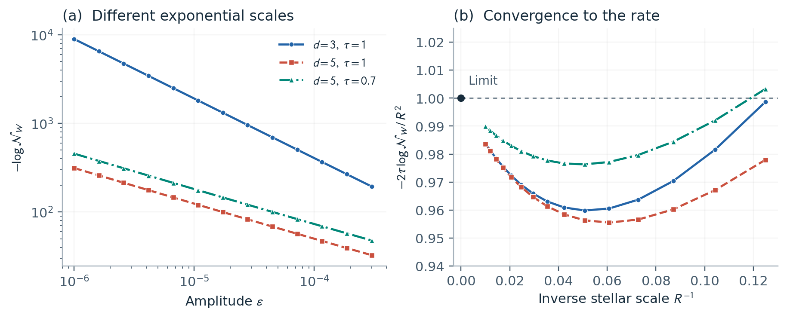
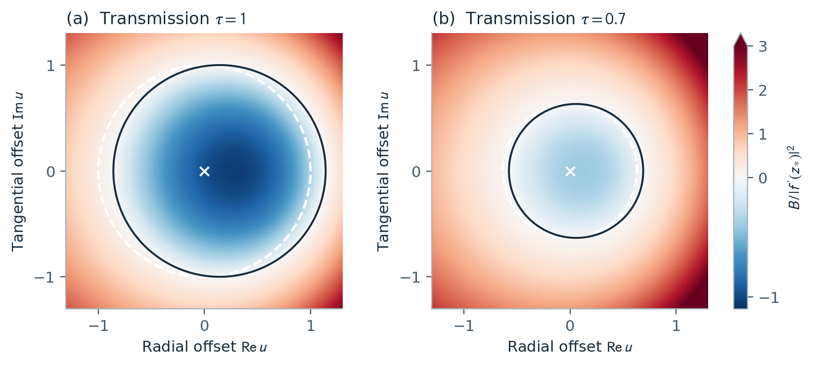

# Two scales of nonclassicality near coherent states

Javier Blanco-Romero

Department of Telematic Engineering, Universidad Carlos III de Madrid, Leganés, Madrid, Spain

## Abstract

A small departure from a coherent state can change optical moments at first order while producing an exponentially small negative Wigner volume. We determine both scales for a fixed finite superposition of displaced number states. The lowest occupied normal level gives the first polynomial moment that responds linearly. The highest occupied level fixes the leading logarithmic rate of Wigner negativity, including its dependence on optical loss. The proof locates negative regions near zeros of the Bargmann polynomial that move into the Gaussian tail. A moment criterion detects the same states at an algebraic order and retains its sign under any nonzero transmission, even after the Wigner function becomes nonnegative.

## Introduction

A weak perturbation of a coherent state can be readily visible in a field moment and almost invisible in the negative part of its Wigner function. These diagnostics sample different features of the state. Moments respond to interference between the coherent component and nearby number states. Wigner negativity can occur far from the coherent amplitude, where the Gaussian envelope is exponentially small. Determining that moving scale requires more than a pointwise expansion of the Wigner function.

The geometry of coherent states provides a natural basis for this comparison \[[1](#ref-field1999geometry), [2](#ref-brody2010coherent)\]. Successive derivatives of the coherent curve generate the displaced number states. After the coherent ray and its tangent direction are removed, the remaining levels form its normal directions. For a fixed finite normal superposition, let $\nu$ be the lowest occupied level and $d$ the highest. We show that $\nu$ determines the first linear response to a polynomial field observable, whereas $d$ determines the leading logarithmic rate of the negative Wigner volume. A single occupied level makes these two integers equal and hides their distinction.

The ingredients have established origins. Nonclassicality criteria based on moments and their homodyne sampling are known \[[3](#ref-shchukin2005nonclassical), [4](#ref-richter1996correlation)\]. Zeros of the Husimi function constrain nonclassical depth \[[5](#ref-lutkenhaus1995)\], and their number defines the stellar hierarchy \[[6](#ref-chabaud2020stellar)\]. Negative Wigner volume is a standard diagnostic \[[7](#ref-kenfack2004negativity)\]; binary Fock superpositions also appear in studies of complex Wigner entropy \[[8](#ref-cerf2024)\]. A recent preprint by He derives a logarithmic Gaussian-tail estimate for the thermal admixture needed to remove negativity from a superposition of vacuum and three photons \[[9](#ref-he2026)\], appendix C. The result here concerns the integrated negative volume for arbitrary fixed finite normal directions under pure loss. Its main content is the general rate and its separation from the lowest moment response.

## Finite normal directions

Let $[a,a^\dagger]=1$, $D(\alpha)=\exp(\alpha a^\dagger-\alpha^*a)$ and $|\alpha\rangle=D(\alpha)|0\rangle$. The unnormalized coherent curve is $|\widetilde\alpha\rangle=e^{\alpha a^\dagger}|0\rangle$. Its derivatives through order $p$ span

$$
\operatorname{span}\{\partial_\alpha^j|\widetilde\alpha\rangle:0\le j\le p\}
 =D(\alpha)\operatorname{span}\{|0\rangle,\ldots,|p\rangle\}.\tag{1}
$$

Indeed, conjugation by $D(\alpha)$ turns $a^\dagger$ into $a^\dagger+\alpha^*$, giving a triangular change of basis with nonzero diagonal. Projectivizing this span gives the $p$th osculating space. The level $0$ is the coherent ray, level $1$ is tangent to the coherent curve, and levels $n\ge2$ are orthogonal normal directions in the projective Hilbert metric.

We therefore consider

$$
|\psi_\epsilon\rangle
 =\frac{|0\rangle+\epsilon\sum_{n=2}^d c_n|n\rangle}{\sqrt{Z_\epsilon}},
 \qquad Z_\epsilon=1+\epsilon^2\sum_{n=2}^d|c_n|^2,
 \qquad \nu=\min\{n:c_n\ne0\},\tag{2}
$$

with $\epsilon>0$, $c_d\ne0$, and fixed coefficients and degree. We call this a finite normal ray. All asymptotic estimates below hold for this fixed finite family.

Let $\rho_{\epsilon,\tau}=\mathcal L_\tau(|\psi_\epsilon\rangle\langle\psi_\epsilon|)$, where $\mathcal L_\tau$ is pure loss with intensity transmission $0\le\tau\le1$. A beam splitter realizes the channel as $a_{\rm out}=\sqrt\tau\,a+\sqrt{1-\tau}\,v$, with $v$ in vacuum. Consequently,

$$
\langle(a^\dagger)^r a^s\rangle_{\rm out}
 =\tau^{(r+s)/2}\langle(a^\dagger)^r a^s\rangle_{\rm in}.\tag{3}
$$

Displacement covariance sends a base amplitude $\alpha$ to $\sqrt\tau\alpha$. Since displacement leaves negative Wigner volume unchanged, it suffices to work at $\alpha=0$. Moments below refer to this displaced frame.

## Two asymptotic scales

We use $W_0(\beta)=2e^{-2|\beta|^2}/\pi$ and define

$$
\mathcal N_W(\rho)=\int_{\mathbb C}[-W_\rho(\beta)]_+\,d^2\beta,
 \qquad [x]_+=\max\{x,0\}.\tag{4}
$$

This is half the excess of the Wigner $L^1$ norm over one.

**Theorem 1.**  For the finite normal ray [(2)](#eq:ray), every polynomial in $a,a^\dagger$ of total degree below $\nu$ has zero first derivative of its expectation at $\epsilon=0$. For fixed $\tau>0$, the normalized moment satisfies

$$
\mathcal M_\nu(\rho_{\epsilon,\tau})
 :=\frac{\langle a^\nu\rangle_{\rho_{\epsilon,\tau}}}{\sqrt{\nu!}}
 =\tau^{\nu/2}\epsilon c_\nu+O(\epsilon^2).\tag{5}
$$

For every fixed $1/2<\tau\le1$,

$$
\lim_{\epsilon\downarrow0}\epsilon^{2/d}
 \log\mathcal N_W(\rho_{\epsilon,\tau})
 =-\frac{(d!)^{1/d}}{2\tau|c_d|^{2/d}}.\tag{6}
$$

For $0\le\tau\le1/2$, the Wigner function is nonnegative and $\mathcal N_W=0$.

The moment statement follows from the number of ladder operators needed to connect $|0\rangle$ to an occupied level. The negative-volume statement comes from a different balance. The highest power of the Bargmann polynomial first competes with its constant term at distance proportional to $\epsilon^{-1/d}$. Negativity forms near its zeros at that distance and inherits the Gaussian factor $\exp[-C\epsilon^{-2/d}]$.

### An exact polynomial kernel

The Bargmann polynomial and a real polynomial kernel are

$$
\begin{aligned}
f_\epsilon(z)&=1+\epsilon\sum_{n=2}^d\frac{c_n z^n}{\sqrt{n!}},\qquad\text{(7)}\\
B_{\epsilon,\tau}(z)&=\sum_{j=0}^d\frac{(1-2\tau)^j}{j!}
                  |f_\epsilon^{(j)}(z)|^2.\qquad\text{(8)}
\end{aligned}
$$

The zeros of $f_\epsilon$ are the stellar zeros; for $\epsilon>0$ the pure input has stellar rank $d$ \[[6](#ref-chabaud2020stellar)\]. The following finite formula is a form of the Bargmann representation of the Wigner function \[[10](#ref-parisio2008)\].

**Lemma 1.**  The lossy state has Wigner function

$$
W_{\epsilon,\tau}(\beta)
 =\frac{2e^{-2|\beta|^2}}{\pi Z_\epsilon}
 B_{\epsilon,\tau}(2\sqrt\tau\,\beta^*).\tag{9}
$$

*Proof.* Unnormalized coherent dyads generate the number basis. Pure loss maps $|\widetilde u\rangle\langle\widetilde v|$ to $e^{(1-\tau)uv^*}|\widetilde{\sqrt\tau u}\rangle\langle\widetilde{\sqrt\tau v}|$. The Wigner function of this image is

$$
\frac2\pi e^{-2|\beta|^2}
 \exp\!\left[(1-2\tau)uv^*+
             2\sqrt\tau(\beta^*u+\beta v^*)\right].\tag{10}
$$

Expanding the first term in the exponential and matching the finite coefficients of $u$ and $v^*$ gives [(9)](#eq:kernel).

At $\tau\le1/2$ every term in [(8)](#eq:B) is nonnegative. At $\tau=1/2$ the formula reduces to a rescaled Husimi density. This familiar positivity threshold is distinct from the small-amplitude asymptotic rate above it.

### Proof of theorem [1](#thm:scales)

Normal ordering cannot increase the total degree of a polynomial. A normally ordered monomial of degree below $\nu$ has no matrix element connecting the vacuum to any occupied $|n\rangle$. This proves the first statement before loss; [(3)](#eq:loss) proves it after loss. Directly,

$$
\langle a^k\rangle_{\psi_\epsilon}
 =\frac{1}{Z_\epsilon}\left[
 \epsilon\sqrt{k!}\,c_k+\epsilon^2
 \sum_{n=2}^{d-k}\sqrt{\frac{(n+k)!}{n!}}\,c_n^*c_{n+k}\right],\tag{11}
$$

where absent coefficients and empty sums are zero. Taking $k=\nu$ gives [(5)](#eq:first).

To prove [(6)](#eq:rate), fix $\tau>1/2$ and put

$$
R=\left(\frac{\sqrt{d!}}{\epsilon|c_d|}\right)^{1/d},
 \qquad q=2\tau-1>0.\tag{12}
$$

On compact sets of the rescaled variable $w$,

$$
f_\epsilon(Rw)=F(w)+O(R^{-1}),
 \qquad F(w)=1+e^{i\arg c_d}w^d,\tag{13}
$$

with convergence of all derivatives with respect to $w$. The $d$ zeros $w_\ell$ of $F$ are simple and satisfy $|w_\ell|=1$. The zeros of $f_\epsilon$ therefore obey

$$
z_{\ell,\epsilon}=Rw_\ell+O(1),\qquad
 f_\epsilon'(z_{\ell,\epsilon})=R^{-1}F'(w_\ell)+O(R^{-2}).\tag{14}
$$

Higher derivatives are $O(R^{-j})$ in any fixed neighborhood of a zero.

Taylor expansion at $z_{\ell,\epsilon}$ gives, uniformly for bounded $u$,

$$
\frac{B_{\epsilon,\tau}(z_{\ell,\epsilon}+u)}
 {|f_\epsilon'(z_{\ell,\epsilon})|^2}
 =|u|^2-q+O(R^{-1}).\tag{15}
$$

The kernel is thus negative on $|u|\le\sqrt q/2$ for sufficiently large $R$, with $-B_{\epsilon,\tau}\ge C R^{-2}$. In the $z$ coordinate,

$$
\mathcal N_W=\frac{1}{2\pi\tau Z_\epsilon}
 \int_{\mathbb C}[-B_{\epsilon,\tau}(z)]_+
             e^{-|z|^2/(2\tau)}\,d^2z.\tag{16}
$$

Integrating over this fixed disk, where $|z|^2=R^2+O(R)$, yields

$$
\log\mathcal N_W\ge-\frac{R^2}{2\tau}-O(R)-O(\log R).\tag{17}
$$

For the upper bound, choose $0<\delta<1$. On $|z|\le(1-\delta)R$, the limiting polynomial satisfies $|F(z/R)|\ge1-(1-\delta)^d>0$. Equation [(13)](#eq:F) and the derivative estimates imply $B_{\epsilon,\tau}>0$ throughout this disk when $R$ is large. Outside it, the coefficients of $B_{\epsilon,\tau}$ remain bounded as $\epsilon\downarrow0$, so its absolute value is at most $C(1+|z|^{2d})$. The Gaussian tail in [(16)](#eq:integral) then gives

$$
\log\mathcal N_W\le-\frac{(1-\delta)^2R^2}{2\tau}+O(\log R).\tag{18}
$$

Divide the bounds by $R^2$, let $\epsilon\downarrow0$, and then let $\delta\downarrow0$. Since $\epsilon^{2/d}R^2=(d!)^{1/d}|c_d|^{-2/d}$, this proves [(6)](#eq:rate). The case $\tau\le1/2$ follows from lemma [1](#lem:kernel).$\square$

The local profile [(15)](#eq:pocket) also gives the limiting radius of each negative region in the physical $\beta$ plane,

$$
r_{\rm pocket}=\frac{\sqrt{2\tau-1}}{2\sqrt\tau},
 \qquad |\beta_{\ell,\epsilon}|=\frac{R}{2\sqrt\tau}+O(1).\tag{19}
$$

The regions retain a finite local size while their centers recede into the tail. Decreasing transmission shrinks them and moves their centers farther out.

## Moment detection under loss

A nonzero annihilation moment alone does not certify nonclassicality of a mixed state. A suitable criterion follows from the moment inequalities of \[[3](#ref-shchukin2005nonclassical)\]. Define

$$
F_j=\langle(a^\dagger)^j a^j\rangle,\qquad
 \mathcal W_k=F_1F_{k-1}-|\langle a^k\rangle|^2,\qquad k\ge2.\tag{20}
$$

For any classical state, represented by a positive measure over coherent amplitudes $\gamma$, Cauchy–Schwarz applied to $\gamma^*$ and $\gamma^{k-1}$ gives $\mathcal W_k\ge0$.

**Proposition 1.** For [(2)](#eq:ray) and fixed $\tau>0$,

$$
\mathcal W_\nu(\rho_{\epsilon,\tau})
 =-\tau^\nu\nu!|c_\nu|^2\epsilon^2+O(\epsilon^3).\tag{21}
$$

Hence the output is nonclassical for all sufficiently small nonzero $\epsilon$, including when $\tau\le1/2$.

*Proof.* For $j\ge1$, $F_j=O(\epsilon^2)$ on the finite ray. Equation [(5)](#eq:first) gives the leading negative term. Moreover, [(3)](#eq:loss) implies the exact identity $\mathcal W_k(\mathcal L_\tau\rho)=\tau^k\mathcal W_k(\rho)$.

For the seed $(|0\rangle+\epsilon|k\rangle)/\sqrt{1+\epsilon^2}$ the result is explicit,

$$
\mathcal W_k(\rho_{\epsilon,\tau})
 =\tau^k k!\,\frac{\epsilon^2(k\epsilon^2-1)}{(1+\epsilon^2)^2}.\tag{22}
$$

It detects the state whenever $0<\epsilon^2<1/k$. Preservation of the witness sign does not imply a fixed statistical cost as $\tau$ decreases.

The first responding moment can be sampled directly by homodyne detection \[[4](#ref-richter1996correlation)\]. With $q_\theta=(e^{-i\theta}a+e^{i\theta}a^\dagger)/\sqrt2$ and physicists' Hermite polynomials $H_k$, set $h_k(q)=H_k(q)/\sqrt{2^k k!}$. Then

$$
\mathcal M_k=\int_0^{2\pi}\frac{d\theta}{2\pi}\,
 e^{ik\theta}\langle h_k(q_\theta)\rangle.\tag{23}
$$

Normal ordering of $H_k(q_\theta)$ and phase integration select $a^k$. For $M$ independent shots with uniformly sampled phases, the sample mean of $e^{ik\theta}h_k(q)$ is unbiased and has complex mean-square error $1/M$ at vacuum. Compensating known loss multiplies this vacuum error by $\tau^{-k}$. This calibration concerns the moment estimator; testing [(20)](#eq:witness) also requires the factorial moments and their uncertainties.

## Examples and numerical checks

Consider the two normal rays

$$
|\psi_3\rangle=\frac{|0\rangle+\epsilon|3\rangle}{\sqrt{1+\epsilon^2}},
 \qquad
 |\psi_{3,5}\rangle=\frac{|0\rangle+\epsilon(|3\rangle+|5\rangle)}{\sqrt{1+2\epsilon^2}}.\tag{24}
$$

Both have $\nu=3$ and $\mathcal M_3=\tau^{3/2}\epsilon+O(\epsilon^3)$. Their negative volumes have exponents $2/3$ and $2/5$, respectively. Figure [1](#fig:rates) compares them and checks the rate using the scaled quantity $-2\tau\log\mathcal N_W/R^2$, whose limit is one. Figure [2](#fig:pockets) shows the local polynomial profile that produces the negative regions.

**Figure 1.** Negative Wigner volume for the two rays in [(24)](#eq:examples). (a) The same first linear moment response accompanies different growth rates of $-\log\mathcal N_W$ as $\epsilon$ decreases. (b) The scaled rates approach the common limit one predicted by [(6)](#eq:rate); each point uses the amplitude corresponding to its $R$ in [(12)](#eq:R). Symbols distinguish the degree and transmission. Curves join numerical quadrature results.

**Figure 2.** Local Wigner kernel near a stellar zero for $|\psi_{3,5}\rangle$ at $R=14$. The plotted quantity is $B_{\epsilon,\tau}(z_*+e^{i\arg z_*}u)/|f_\epsilon'(z_*)|^2$, with $z_*$ a zero of smallest modulus. Both panels use the same color scale. Solid curves mark its exact zero contour; dashed circles have radius $\sqrt{2\tau-1}$ from [(15)](#eq:pocket). The horizontal coordinate points radially outward in the $z$ plane. The Gaussian envelope has been divided out to resolve the sign structure; the colors do not represent Wigner density.

The numerical calculation evaluates [(16)](#eq:integral) around each separated stellar zero. Bisection finds the sign boundary along angular rays, followed by Gauss–Legendre quadrature in angle and radius. Gaussian weights are accumulated through logarithms. This resolves negative volumes far below floating-point underflow without imposing a numerical floor. The routine checks root separation and samples for extra radial sign crossings; it is restricted to isolated simple negative regions.

For the plotted rates, refinement from 64 radial and 192 angular nodes to 96 and 384 nodes changes $\log\mathcal N_W$ by less than $10^{-7}$. At $R=8$, independent Cartesian integration agrees within $8\times10^{-4}$ in relative negative volume for three test directions, including complex coefficients. A separate density-matrix calculation applies the loss channel in the number basis and evaluates the Wigner function through associated Laguerre polynomials. Its maximum absolute discrepancy from [(9)](#eq:kernel) is below $2\times10^{-12}$ for random states of degrees $3$, $5$ and $8$ at transmissions $0.1$, $0.5$, $0.7$ and $1$. These checks support the implementation; the bounds [(17)](#eq:lower) and [(18)](#eq:upper) establish the asymptotic result.

The accompanying code includes the independent kernel evaluation, quadrature refinement, and moment checks.

## Scope of the result

The coefficients, degree and transmission are fixed in theorem [1](#thm:scales). Its limit need not be uniform as $c_d\to0$, $d\to\infty$ or $\tau\downarrow1/2$. The power is also sensitive to how the state approaches the coherent manifold. For example, the normalized path proportional to

$$
|0\rangle+\epsilon|3\rangle+\epsilon^2|8\rangle\tag{25}
$$

has the same tangent as $|\psi_3\rangle$. Its Bargmann polynomial, rescaled by $R=(8!)^{1/16}\epsilon^{-1/4}$, tends to $1+w^8$ because the cubic term is $O(\epsilon^{1/4})$. Repeating the proof gives

$$
\lim_{\epsilon\downarrow0}\epsilon^{1/2}\log\mathcal N_W
 =-\frac{(8!)^{1/8}}{2\tau},\qquad \tau>1/2.\tag{26}
$$

Thus a tangent direction alone does not determine the tail exponent for a general path.

For fixed finite normal rays, the conclusion is precise. The first occupied level sets the lowest linear moment response and its loss factor. The last occupied level sets the distance of the stellar zeros and the exponential rate of the negative Wigner volume. A moment witness can therefore detect a perturbation at an algebraic order while its negative Wigner volume is smaller than every power of the amplitude.

## Data availability

The accompanying code generates the figures and numerical data and runs the validation checks.

## AI assistance

The research vision and original ideas are the author's. The author used OpenAI's GPT models, including Astra, and Anthropic's Claude Opus models for writing, theorem proving, and literature review. GPT models were used most often, and Astra was the most useful overall. This work is in progress. Not all claims have been verified by a human.

## References

\[1\]

Timothy R Field and Lane P Hughston. The geometry of coherent states. *Journal of Mathematical Physics*, 40(6):2568–2583, 1999.

\[2\]

Dorje C Brody and Eva-Maria Graefe. Coherent states and rational surfaces. *Journal of Physics A: Mathematical and Theoretical*, 43(25):255205, 2010.

\[3\]

Evgeny V. Shchukin and Werner Vogel. Nonclassical moments and their measurement. *Physical Review A*, 72(4):043808, 2005.

\[4\]

Th. Richter. Determination of field correlation functions from measured quadrature component distributions. *Physical Review A*, 53(2):1197–1199, 1996.

\[5\]

Norbert Lütkenhaus and Stephen M. Barnett. Nonclassical effects in phase space. *Physical Review A*, 51(4):3340–3342, 1995.

\[6\]

Ulysse Chabaud, Damian Markham, and Frédéric Grosshans. Stellar representation of non-Gaussian quantum states. *Physical Review Letters*, 124(6):063605, 2020.

\[7\]

Anatole Kenfack and Karol Życzkowski. Negativity of the Wigner function as an indicator of non-classicality. *Journal of Optics B: Quantum and Semiclassical Optics*, 6(10):396–404, 2004.

\[8\]

Nicolas J. Cerf, Anaelle Hertz, and Zacharie Van Herstraeten. Complex-valued Wigner entropy of a quantum state. *Quantum Studies: Mathematics and Foundations*, 11(2):331–362, 2024.

\[9\]

Zixuan He. Wigner entropy below vacuum: physical counterexamples and stability limits. [arXiv:2609.13312v2 \[quant-ph\]](https://arxiv.org/abs/2609.13312v2), 2026. Preprint, version 2, 24 September 2026.

\[10\]

Fernando Parisio. On Bargmann representations of Wigner function. *Journal of Physics A: Mathematical and Theoretical*, 41(5):055305, 2008.
