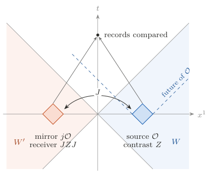
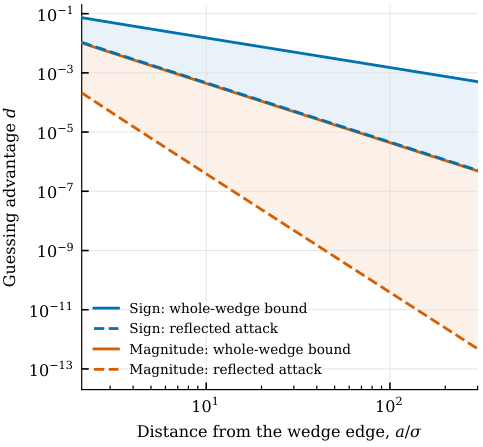

# Spacelike Guessing of Quantum Randomness

Javier Blanco-Romero

Department of Telematic Engineering, Universidad Carlos III de Madrid, Leganés, Madrid, Spain

## Abstract

How private is a random bit against an observer confined to a spacelike region? For a binary measurement of the quantum vacuum, we identify an overlap that both quantifies an explicit guessing attack and bounds every measurement in the opposite wedge. The attack uses the modular reflection of the source readout; its advantage is half the overlap, while the universal upper bound is half its square root. The bounds hold for general von Neumann algebras and recover known discrimination bounds in finite dimensions. For a free scalar field, the overlap is an ordinary Gaussian correlation. A Hermite expansion then shows how the readout controls leakage. For compact massless sources, replacing a sign threshold by a balanced magnitude threshold improves the whole-wedge privacy bound from inverse distance to inverse distance squared. Spacetime access and the choice of readout thus determine a quantitative privacy guarantee for a single vacuum-generated bit.

## Introduction

A random number generator is secure only relative to a description of what an adversary may hold. Security proofs for quantum random number generators describe this side information as a quantum system correlated with the source \[[1](#ref-herrero2017quantum)\], and the conditional min-entropy turns it into a guessing probability \[[2](#ref-koenig2009operational)\]. Relativity suggests a more concrete description. An adversary is a laboratory, and a laboratory occupies a region of spacetime. The question then becomes geometric. If a bit is produced by measuring a quantum field in a bounded region, how well can someone confined to a spacelike separated region predict it?

Microcausality settles part of the answer. Spacelike observers cannot influence the bit, and the source cannot signal to them. It does not make the bit independent of their records. The vacuum is entangled across spacelike regions \[[3](#ref-summers1987maximal), [4](#ref-reznik2003entanglement), [5](#ref-pozas2015harvesting)\], and conditioning on a local measurement outcome changes the state assigned to spacelike observables even though the unconditioned state does not change \[[6](#ref-fewster2020quantum)\]. A spacelike laboratory can therefore hold information about a bit that nobody sent to it. Relativistic analyses of randomness generation have quantified how a detector exchanges information with a field \[[7](#ref-thinh2016certified), [8](#ref-lopp2018light)\]. Here we ask how much the field itself reveals to a spacelike region, and which measurement there reveals it.

For a source inside a wedge, Tomita–Takesaki theory provides an explicit receiver. Its modular conjugation $J$ maps the source contrast $Z$, the difference of its two measurement effects, to a commuting contrast $JZJ$. Under the Bisognano–Wichmann property this map is geometric: the receiver can act in a reflected copy of the source region (Fig. [1](#fig:geometry)). Its guessing advantage is $C_Z/2$, where $C_Z$ is a positive modular overlap. The advantage of any receiver in the opposite wedge is at most $\sqrt{C_Z}/2$. Thus a quantity determined by the source and the vacuum supplies both an achievable attack and a privacy bound for an entire spacetime region.

For a free scalar field, this overlap is the correlation of two ordinary Gaussian variables passed through the same readout. Expanding the readout in Hermite polynomials reveals a simple way to reduce leakage. A sign threshold retains the linear correlation. A fair threshold on the field magnitude removes it, improving the bound for every receiver in the opposite wedge. We calculate both bounds for a smooth compact source profile. Appendix [A](#sec:cost) relates the overlap to modular energy and explains why that coarser estimate can miss the leakage of sharp readouts.

The ingredients have established precedents. Positivity of modularly reflected correlations follows from standard-form theory \[[9](#ref-araki1974some)\]. Summers and Werner used wedge modular theory to study maximal Bell violations \[[3](#ref-summers1987maximal)\]; scalar-field and detector constructions likewise use reflected observables \[[10](#ref-guedes2024unruh), [11](#ref-caribe2026modular)\]. In finite dimensions our mirror receiver is the pretty good measurement \[[12](#ref-hausladen1994pretty), [13](#ref-barnum2002reversing)\], and the upper bound is the binary case of Renes's discrimination inequality \[[14](#ref-renes2017better)\]. We give a direct modular proof valid without a tensor-factor description of the laboratories. The contribution is its use as a regional privacy bound, together with a localized receiver and explicit readout-dependent suppression in a field theory.

We use units with $\hbar=c=1$. Logarithms $\ln$ are natural; entropies of bits use $\log_2$.

## A bit and its spacelike receiver

Let $\mathcal M$ be a von Neumann algebra acting on a Hilbert space $\mathcal H$ with a cyclic and separating unit vector $\Omega$, and write $\omega(A)=\langle\Omega,A\Omega\rangle$. In field theory $\mathcal M$ is the algebra of a region and $\Omega$ the vacuum, which is cyclic and separating by the Reeh–Schlieder theorem \[[15](#ref-haag1996local)\]. A source measures two effects in $\mathcal M$,

$$
E_\pm=\tfrac12(\mathbf{1}\pm Z),\qquad Z=Z^*,\quad \|Z\|\le1,\quad \omega(Z)=0 .\tag{1}
$$

We call $Z$ the measurement contrast. The last condition makes the bit fair. The vacuum variance $q=\omega(Z^2)\in(0,1]$ measures how strongly the bit is drawn from the field. A sharp measurement has $Z^2=\mathbf{1}$ and $q=1$, while an independent fair coin tossed with a trusted ancilla has $Z=0$. The latter case has zero leakage to the field and is excluded below by taking $Z\ne0$.

A receiver holds an algebra $\mathcal N\subseteq\mathcal M'$, the commutant of $\mathcal M$; a spacelike laboratory provides such an algebra by microcausality. If the source uses an instrument with Kraus operators $L_{\pm a}\in\mathcal M$ and $\sum_aL_{\pm a}^*L_{\pm a}=E_\pm$, the receiver's subnormalized conditional functionals are

$$
\omega_\pm(B)=\sum_a\omega(L_{\pm a}^*BL_{\pm a})=\omega(E_\pm B),\qquad B\in\mathcal N,\tag{2}
$$

The equality uses commutation of each $L_{\pm a}$ with $B$. Every effect pair admits such a local instrument, for example $L_\pm=\sqrt{E_\pm}$. Summing the two functionals recovers $\omega|_\mathcal N$, which expresses the absence of signalling. A receiver with effects $F_\pm\in\mathcal N$ succeeds with probability $\sum_x\omega(E_xF_x)$. Its optimum defines the conditional min-entropy,

$$
H_{\min}(X|\mathcal N)=-\log_2P_{\rm guess}(X|\mathcal N),
$$

with the same operational meaning for von Neumann algebras \[[2](#ref-koenig2009operational), [16](#ref-berta2016smooth)\].

Binary discrimination \[[17](#ref-helstrom1969quantum)\] reduces the optimum to one norm. With $\ell_Z(B)=\omega(ZB)$ for $B\in\mathcal N$, writing $F_\pm=\tfrac12(\mathbf{1}\pm B)$ and optimizing over Hermitian contractions $B$ gives $P_{\rm guess}=\tfrac12(1+\|\ell_Z\|_{\mathcal N_*})$, where $\|\cdot\|_{\mathcal N_*}$ is the norm of normal functionals. The natural cryptographic figure of merit is the distance from an ideal bit. If $\omega_{X\mathcal N}$ is the classical-quantum state with components $\omega_\pm$ and $u_X$ is a uniform bit, then $\omega_\pm-\tfrac12\omega=\pm\tfrac12\ell_Z$ and

$$
\begin{aligned}
 d(X|\mathcal N)&:=\tfrac12\bigl\|\omega_{X\mathcal N}-u_X\otimes\omega|_\mathcal N\bigr\|\\
 &=\tfrac12\|\ell_Z\|_{\mathcal N_*}=P_{\rm guess}(X|\mathcal N)-\tfrac12 .
\end{aligned}\tag{3}
$$

We call the bit $\varepsilon$-private against $\mathcal N$ when $d(X|\mathcal N)\le\varepsilon$, and refer to $d$ as the privacy error.

## The modular overlap

The Tomita operator $SA\Omega=A^*\Omega$, $A\in\mathcal M$, is closable, and its closure has the polar decomposition $S=J\Delta^{1/2}$. The modular conjugation $J$ is an antiunitary involution with $J\Omega=\Omega$ and $J\mathcal MJ=\mathcal M'$, and the modular operator $\Delta$ is positive and injective \[[18](#ref-witten2018aps)\]. For $A\in\mathcal M$ the definition of $S$ reads

$$
\Delta^{1/2}A\Omega=JA^*\Omega .\tag{4}
$$

The quantity that governs spacelike guessing is

$$
C_Z=\langle Z\Omega,\Delta^{1/2}Z\Omega\rangle=\|\Delta^{1/4}Z\Omega\|^2 .\tag{5}
$$

By Eq. [(4)](#eq:half), $C_Z=\langle Z\Omega,JZ\Omega\rangle$ is the overlap between the excitation created by the contrast and its modular reflection, hence $C_Z\le q$. It is strictly positive whenever $Z\neq0$, because $\Omega$ is separating and $\Delta^{1/4}$ has trivial kernel.

**Theorem 1 (Modular overlap).**  Let $Z$ be as in Eq. [(1)](#eq:effects).

1.  The mirror receiver with effects $\tfrac12(\mathbf{1}\pm JZJ)\in\mathcal M'$ guesses the source outcome with probability $\tfrac12(1+C_Z)$.

2.  Every receiver $\mathcal N\subseteq\mathcal M'$ obeys $d(X|\mathcal N)\le\tfrac12\sqrt{C_Z}$.

Consequently,

$$
C_Z\ \le\ 2\,d(X|\mathcal M')\ \le\ \sqrt{C_Z} .\tag{6}
$$

*Proof.* For (a), the Hermitian contraction $JZJ$ belongs to $\mathcal M'$, so the mirror effects are admissible. Expanding $\sum_x\omega(E_x\tfrac12(\mathbf{1}+xJZJ))$ and using $\omega(Z)=0$ and $\omega(JZJ)=\overline{\omega(Z)}=0$ leaves $\tfrac12[1+\omega(Z\,JZJ)]$. Since $J\Omega=\Omega$ and $Z=Z^*$, Eq. [(4)](#eq:half) gives $\omega(Z\,JZJ)=\langle Z\Omega,JZ\Omega\rangle=C_Z$.

For (b), it suffices to take $\mathcal N=\mathcal M'$. Every Hermitian contraction $B\in\mathcal M'$ has the form $B=JAJ$ with $A=JBJ$ a Hermitian contraction in $\mathcal M$. Then Eq. [(4)](#eq:half) and the Cauchy–Schwarz inequality give

$$
|\omega(ZB)|=|\langle Z\Omega,\Delta^{1/2}A\Omega\rangle|
 \le\|\Delta^{1/4}Z\Omega\|\,\|\Delta^{1/4}A\Omega\| .\tag{7}
$$

The second factor is $\omega(A\,JAJ)^{1/2}\le\|A\|\le1$, so $\|\ell_Z\|_{\mathcal M'_*}\le\sqrt{C_Z}$, and Eq. [(3)](#eq:privacy) finishes the proof. Equation [(6)](#eq:window) combines (a) with (b).

The two inequalities have different uses. The condition $C_Z\le4\varepsilon^2$ certifies $\varepsilon$-privacy against the whole commutant; $C_Z>2\varepsilon$ rules it out against a receiver able to measure $JZJ$. Equivalently,

$$
1-\log_2(1+\sqrt{C_Z})\le H_{\min}(X|\mathcal M')
 \le1-\log_2(1+C_Z).\tag{8}
$$

These bounds concern the receiver's field observables. Additional side information, such as a purification of a measurement ancilla outside this algebra, changes the access model.

The finite-dimensional case identifies the underlying discrimination problem. Let $\rho$ be a faithful density matrix and let $\Omega=\sum_i\sqrt{p_i}|i\rangle|i\rangle$ be its canonical purification, with $\mathcal M$ acting on the first factor. Then

$$
C_Z=\operatorname{Tr}(\sqrt\rho\,Z\sqrt\rho\,Z),\qquad
 2d=\|\sqrt\rho\,Z\sqrt\rho\|_1.\tag{9}
$$

On the second factor, the conditional density operators and their pretty good measurement are

$$
\tau_\pm=(\sqrt\rho E_\pm\sqrt\rho)^{\mathsf T},\qquad
 F_\pm^{\rm PGM}=E_\pm^{\mathsf T}.
$$

Thus $P_{\rm PGM}=(1+C_Z)/2$. Renes's bound $P_{\rm PGM}\ge P_{\rm opt}^2+(1-P_{\rm opt})^2$ \[[14](#ref-renes2017better)\] is exactly the upper inequality in Eq. [(6)](#eq:window); $P_{\rm opt}\ge P_{\rm PGM}$ gives the lower one. Our proof applies the same comparison directly to a standard pair $(\mathcal M,\Omega)$, including local field algebras.

Both ends are attained. For $\rho=\operatorname{diag}(p,1-p)$, $p=(1+e^{-b})^{-1}$, and $Z=\sigma_x$, Eq. [(9)](#eq:matrix) gives $2d=C_Z=\operatorname{sech}(b/2)$. For $\rho=\mathbf{1}/2$ and $Z=t\sigma_z$, $0<t\le1$, it instead gives $2d=t=\sqrt{C_Z}$. The latter example uses an unsharp readout when $t<1$ and establishes exact sharpness over the class of binary effects in Theorem [1](#thm:main).

## Geometry

Let $W=\{x:x^1>|t|\}$ be the right wedge and $W'=\{x:x^1<-|t|\}$ its causal complement, in $3+1$ dimensions, and take $\mathcal M=\mathcal A(W)$ in a theory satisfying wedge duality and the Bisognano–Wichmann property. These properties hold for the neutral scalar fields considered below. Bisognano and Wichmann showed that the modular group of $(\mathcal A(W),\Omega)$ is the group of boosts preserving $W$ and that $J$ implements the reflection \[[19](#ref-bisognano1975duality), [20](#ref-bisognano1976duality)\]

$$
j(t,x^1,\boldsymbol{x}_\perp)=(-t,-x^1,\boldsymbol{x}_\perp),\qquad J\mathcal A(\mathcal O)J=\mathcal A(j\mathcal O),\tag{10}
$$

with $\mathcal A(W)'=\mathcal A(W')$. For a neutral scalar field and a real test function $f$, $J\Phi(f)J=\Phi(f\circ j)$. In these units $K=2\pi B$, where $B=\int_{t=0}x^1T_{00}\,d^3x$ generates the boosts.

**Figure 1.** A source measures a bit in a bounded region $\mathcal O$ inside the wedge $W$. The modular conjugation $J$ maps its contrast $Z$ to an observable of the reflected region $j\mathcal O\subset W'$, which lies outside the causal future of $\mathcal O$. No signal connects the two laboratories, yet their records, compared later in a common future, are correlated with strength $C_Z$.

If $Z\in\mathcal A(\mathcal O)$ with $\mathcal O\subset W$, its mirror lies in the bounded region $j\mathcal O$. The lower bound therefore needs only a reflected laboratory, whereas the upper bound applies to all observables in $\mathcal A(W')$. A different wedge containing $\mathcal O$ gives a different mirror and a different allowed receiver region. Such bounds can be compared only after fixing the adversary's access region. The generator $B$ is the full boost generator, with the integral over the entire Cauchy surface. Appendix [A](#sec:cost) discusses the corresponding energy estimate. We use wedge reflection throughout the explicit calculations.

## Free fields

Let $\Phi$ be a free neutral scalar field of any mass in its vacuum, and let $f\in C_c^\infty(W)$ be real with nonzero one-particle vector $h=\Phi(f)\Omega$. Write $\delta$ for the modular operator on the one-particle space \[[21](#ref-eckmann1973application)\]. Two numbers describe the readout geometry,

$$
\begin{aligned}
 v&=\|h\|^2=\omega\bigl(\Phi(f)^2\bigr),\\
 c&=\omega\bigl(\Phi(f)\Phi(f\circ j)\bigr)=\langle h,\delta^{1/2}h\rangle ,
\end{aligned}\tag{11}
$$

and their ratio $\rho=c/v\in(0,1)$ is the vacuum correlation coefficient between the smeared field and its mirror image. The one-particle Tomita identity gives $\delta^{1/2}h=j_1h$, where $j_1$ is the one-particle restriction of $J$. This proves the second expression for $c$ without applying the bounded-operator identity to the unbounded field. Positivity follows as for $C_Z$. Equality $\rho=1$ would require a nonzero boost-invariant one-particle vector, which is absent in the scalar one-particle space.

Consider a readout $Z=F(\Phi(f))$, with $F$ a real Borel function, $|F|\le1$ and $\mathbb EF(\xi)=0$, where $\xi$ is a centered Gaussian variable of variance $v$. Use the normalized probabilists' Hermite polynomials $\mathrm{He}_n/\sqrt{n!}$, with coefficients

$$
a_n=\frac{\mathbb E\bigl[F(\xi)\,\mathrm{He}_n(\xi/\sqrt v)\bigr]}{\sqrt{n!}},\qquad a_0=0 .\tag{12}
$$

**Proposition 2 (Free-field overlap).**  With these definitions,

$$
C_Z=\sum_{n\ge1}a_n^2\rho^n=\mathbb E\bigl[F(\xi)F(\eta)\bigr],\tag{13}
$$

where $(\xi,\eta)$ is a centered Gaussian pair with variances $v$ and covariance $c$. Moreover $q=\sum_na_n^2$, so $C_Z\le q\rho$ and every receiver in $W'$ obeys

$$
d\bigl(X|\mathcal A(W')\bigr)\le\tfrac12\sqrt{q\rho} .\tag{14}
$$

*Proof.* The spacelike fields $\Phi(f)$ and $\Phi(f\circ j)$ commute, and their joint vacuum distribution is Gaussian with covariance [(11)](#eq:vc). Hence $\omega(ZJZJ)=\mathbb E[F(\xi)F(\eta)]$. For a Gaussian pair with correlation $\rho$, Mehler's identity gives

$$
\mathbb E\left[\frac{\mathrm{He}_n(\xi/\sqrt v)}{\sqrt{n!}}\,
          \frac{\mathrm{He}_m(\eta/\sqrt v)}{\sqrt{m!}}\right]
 =\delta_{nm}\rho^n .
$$

Expanding $F$ in this orthonormal basis proves the series \[[22](#ref-janson1997gaussian)\]. The expansion converges in Gaussian $L^2$, and Cauchy–Schwarz justifies passage to the joint expectation. Parseval gives $q=\sum_n a_n^2$. Since $a_0=0$ and $0<\rho<1$, $C_Z\le q\rho$; Theorem [1](#thm:main) supplies the privacy bound.

A threshold readout records the sign of the smeared field, $Z=\operatorname{sgn}\Phi(f)$. It is the scalar analogue of the vacuum homodyne generators that digitize the sign of a field quadrature \[[23](#ref-gabriel2010generator), [24](#ref-symul2011real)\]. Here $q=1$ and Sheppard's arcsine law \[[25](#ref-sheppard1899application)\] gives

$$
C_Z=\frac2\pi\arcsin\rho .\tag{15}
$$

The Hermite expansion, a standard description of Gaussian correlations, now has a regional security interpretation. For a fixed readout and variance $v$, it shows how the readout changes the distance dependence. Let $r=\min\{n\ge1:a_n\ne0\}$, the Hermite rank. Then

$$
C_Z=a_r^2\rho^r+O(\rho^{r+1}),\qquad
 d(X|\mathcal A(W'))\le\tfrac12\sqrt q\,\rho^{r/2}.\tag{16}
$$

For example, let $\Phi_{\rm G}$ and $\phi_{\rm G}$ denote the standard normal distribution and density, and set $z_0=\Phi_{\rm G}^{-1}(3/4)$. The sharp readout

$$
F(\xi)=2\,\mathbf1_{\{|\xi|>z_0\sqrt v\}}-1\tag{17}
$$

is fair and even. Its first nonzero Hermite coefficient is $a_2=2\sqrt2\,z_0\phi_{\rm G}(z_0)$, obtained by integrating $(u^2-1)\phi_{\rm G}(u)$ over the two tails. Hence its mirror advantage is $O(\rho^2)$ and its whole-wedge privacy error is at most $\rho/2$. Both this readout and the sign readout are sharp and produce a fair bit entirely from the field. The improvement comes from which feature of the field is recorded, at fixed variance $q=1$.

An unsharp, smooth even readout gives the same rank-two suppression at finite modular energy (Appendix [A](#sec:cost)). With $m=e^{-v/2}$,

$$
F(\xi)=\frac{\cos\xi-m}{1+m},\qquad
 C_Z=\frac{m^2[\cosh(\rho v)-1]}{(1+m)^2}.\tag{18}
$$

This $F$ is fair and bounded by one, and its derivative is square integrable. The covariance follows directly from the Gaussian characteristic function.

A Ramsey probe is a qubit prepared in $|{+}x\rangle$, coupled through $\exp[-\tfrac i2\sigma_z\otimes\Phi(f)]$ and read out in the $\sigma_y$ basis. We assume trusted preparation and control of the probe. Because the free-field commutator is a c-number, time ordering of a spacetime-smeared longitudinal coupling only adds a phase, so this probe induces the field effects $\tfrac12[\mathbf{1}\pm\sin\Phi(f)]$ exactly. Proposition [2](#prop:free) with $F=\sin$ gives

$$
C_Z=e^{-v}\sinh(\rho v),\qquad q=\tfrac12(1-e^{-2v}).\tag{19}
$$

Sharp thresholds are idealized effects. Every nonconstant sharp readout of one smeared field has infinite mean modular energy, as shown in Appendix [A](#sec:cost). The bounded effects and their guessing probabilities remain well defined. The overlap bounds therefore apply even when a modular-energy estimate gives no useful information.

The reflected field also defines an exactly solvable receiver class. Let $\mathcal N_f$ be the abelian algebra generated by $\Phi(f\circ j)$. Its effects are functions of this one observable, so conditional expectation gives

$$
2d(X|\mathcal N_f)=\mathbb E\bigl|\mathbb E[F(\xi)|\eta]\bigr|.\tag{20}
$$

Indeed, a receiver with contrast $G(\eta)$ has advantage $\tfrac12\mathbb E[F(\xi)G(\eta)]$, maximized by $G=\operatorname{sgn}\mathbb E[F(\xi)|\eta]$. For the sign readout this is $G(\eta)=\operatorname{sgn}\eta$ and $d(X|\mathcal N_f)=\pi^{-1}\arcsin\rho$. This is an exact optimum for $\mathcal N_f$ and a lower bound for the larger algebra $\mathcal A(W')$. For the Ramsey readout,

$$
\mathbb E[\sin\xi|\eta]=e^{-v(1-\rho^2)/2}\sin(\rho\eta),\tag{21}
$$

so $G(\eta)=\operatorname{sgn}\sin(\rho\eta)$ improves on the modular mirror contrast $\sin\eta$. Under $f\mapsto\lambda f$ at fixed geometry, its advantage is $\lambda\rho\sqrt{2v/\pi}/2+o(\lambda)$, whereas $\sqrt{C_Z}=\lambda\sqrt{\rho v}+o(\lambda)$. Here $v$ denotes the variance before rescaling and $\lambda\downarrow0$. Thus the square-root scaling also occurs for field readouts.

**Figure 2.** Privacy bounds for the compact source [(22)](#eq:profile) and two sharp fair readouts. Each solid curve is the whole-wedge upper bound $\sqrt{C_Z}/2$; each dashed curve is the reflected attack $C_Z/2$. The shaded bands contain the respective optimal guessing advantages. The sign attack and magnitude upper bound nearly coincide. The magnitude readout improves the upper bound from order $a^{-1}$ to $a^{-2}$. Only the sign attack is proved optimal in the single reflected-field algebra $\mathcal N_f$.

## How fast the leak decays

To see the size of these effects, take a massless field and a time-symmetric source profile of size $\sigma$ centered at distance $a$ from the wedge edge,

$$
f(t,\boldsymbol{x})=\lambda\,b(t/\sigma)\,B\bigl(|\boldsymbol{x}-a\boldsymbol{e}_1|/\sigma\bigr),\tag{22}
$$

where $b(s)=B(s)=e^{-1/(1-s^2)}$ for $|s|<1$ and zero otherwise. The support is compactly contained in $W$ when $a>2\sigma$. Since $f\circ j$ is the same profile centered at $-a\boldsymbol{e}_1$, the receiver repeats the source's experiment at the mirror point. Appendix [B](#app:profile) reduces $v$, $c$ and $S_f$ to one-dimensional integrals. At large distance the massless Wightman function at spacelike separation $2a$, namely $(16\pi^2a^2)^{-1}$, controls the correlation, and

$$
\rho=\frac{1}{16\pi^2a^2v}\Bigl(\int f\,d^4x\Bigr)^2\bigl[1+O(\sigma^2/a^2)\bigr] .\tag{23}
$$

For these bumps $\rho\simeq0.145\,(\sigma/a)^2$; the leading term is accurate to about $0.2\%$ at $a=10\sigma$.

Figure [2](#fig:leakage) separates the source readouts and the receiver classes. For the sign readout, the reflected receiver advantage falls as $a^{-2}$ and the whole-wedge upper bound as $a^{-1}$. The Ramsey readout has the same powers. These powers do not coincide, so the optimal whole-wedge asymptote is not determined by the calculation. In contrast, the balanced magnitude readout of Eq. [(17)](#eq:magnitude) has a whole-wedge upper bound of order $a^{-2}$ and a mirror advantage of order $a^{-4}$, directly from Eq. [(16)](#eq:rank). The inverse-square mirror leak is a property of particular readouts and profiles, not a universal rate.

The profile can also suppress the leading geometric correlation. For a fixed compact profile translated away from the edge, $\int f\,d^4x=0$ removes both the $a^{-2}$ and $a^{-3}$ terms of the massless kernel expansion: each contains this integral as a factor. Then $\rho=O(a^{-4})$, with faster decay possible if further moments vanish.

At $a=10\sigma$, $\rho\simeq1.45\times10^{-3}$. The exact overlap gives a whole-wedge privacy bound of approximately $0.0152$ for the sign readout and $4.41\times10^{-4}$ for the balanced magnitude readout. These are upper bounds on the guessing advantage, not measurements of the optimum. All distances are relative to the source's spatial and temporal scale; this model does not specify the security of an optical device.

## Conclusion

The privacy of a vacuum-generated bit depends on both the readout and the spacetime region available to an adversary. The modular overlap makes this dependence quantitative. It gives an explicit reflected guessing attack and, through its square root, an upper bound for every receiver in the opposite wedge. The finite-dimensional discrimination bound is known; geometric modular theory turns it into a statement about physical access to a quantum field.

For a free scalar vacuum, evaluating the overlap requires only a Gaussian correlation. The first nonzero Hermite coefficient determines how the privacy bound falls with separation. In the compact massless example, recording whether the field magnitude exceeds a balanced threshold improves the whole-wedge upper bound from inverse distance to inverse distance squared, while still producing a sharp fair bit. The readout is therefore a concrete part of the privacy design.

These are single-round guarantees for the specified field access algebra. The gap between the reflected attack and the whole-wedge upper bound leaves the optimal asymptote open. Private-string extraction \[[26](#ref-tomamichel2011leftover), [16](#ref-berta2016smooth)\] additionally requires a block min-entropy bound: successive measurements can share correlations with one another and with the same receiver, so the single-bit bounds cannot be multiplied without further assumptions. Finite-resource detector implementations and such multi-round bounds are the next steps toward a field-based security analysis of a random number generator.

## Data availability

The accompanying code specifies the numerical source profiles, generates the figure data, and runs the numerical checks.

## Modular energy and sharp readouts

A mean modular energy gives a coarser lower bound on the overlap. This connects the guessing problem with modular estimates for local state preparation \[[27](#ref-blanco2026modular)\]. The modular Hamiltonian $K=-\ln\Delta$ relates the overlap to an energy expectation. Let $\psi_Z=Z\Omega/\sqrt q$ and let $\mu_Z$ be the spectral measure of $K$ in $\psi_Z$. Equation [(4)](#eq:half) gives the normalization

$$
\int e^{-k}\,d\mu_Z(k)=\|\Delta^{1/2}\psi_Z\|^2=\frac{\|JZ\Omega\|^2}{q}=1 .\tag{24}
$$

Since $\max(-k,0)\le e^{-k}$, the negative part of $k$ is integrable, and the mean modular energy

$$
\kappa_Z=\int k\,d\mu_Z(k)\in[0,\infty]\tag{25}
$$

is always defined. Jensen's inequality applied to Eq. [(24)](#eq:balance) gives $\kappa_Z\ge0$.

**Proposition 3 (Entropic cost).**  The overlap obeys $C_Z\ge q\,e^{-\kappa_Z/2}$. If the measurement is sharp, $Z^2=\mathbf{1}$, then

$$
\kappa_Z=S(\omega_Z\|\omega),\qquad \omega_Z(A)=\omega(ZAZ),\quad A\in\mathcal M,\tag{26}
$$

where $S$ is Araki's relative entropy on $\mathcal M$ \[[28](#ref-araki1975relative)\].

*Proof.* Jensen's inequality for the convex function $e^{-k/2}$ gives $C_Z/q=\int e^{-k/2}d\mu_Z\ge e^{-\kappa_Z/2}$. If $Z^2=\mathbf{1}$, then $Z$ is a unitary in $\mathcal M$, and the vector $Z\Omega$ represents $\omega_Z$ on $\mathcal M$ and $\omega$ on $\mathcal M'$. The relative Tomita operator $AZ\Omega\mapsto A^*\Omega$ equals $ZS$ on the dense set $\mathcal MZ\Omega=\mathcal M\Omega$, so the relative modular operator is $(ZS)^*(ZS)=S^*S=\Delta$. Araki's definition $S(\omega_Z\|\omega)=-\langle Z\Omega,\ln\Delta_{\Omega,Z\Omega}\,Z\Omega\rangle$ then reduces to $\langle Z\Omega,KZ\Omega\rangle=\kappa_Z$.

For a sharp measurement the contrast is a unitary flip, and $\kappa_Z$ measures its relative entropy on the source algebra. For the Lüders instrument, each normalized branch $(\Omega\pm Z\Omega)/\sqrt2$ has mean modular energy $\kappa_Z/2$, since $K\Omega=0$. This is an expectation of the modular Hamiltonian, not a general lower bound on laboratory work.

**Corollary 4 (Entropic converse).**  For a sharp fair bit and any receiver containing $JZJ$,

$$
d(X|\mathcal N)\ \ge\ \tfrac12\,e^{-S(\omega_Z\|\omega)/2} .\tag{27}
$$

Privacy error $\varepsilon<\tfrac12$ against such a receiver requires $S(\omega_Z\|\omega)\ge2\ln[1/(2\varepsilon)]$.

The coefficient $1/2$ in the exponential cannot be reduced. In the two-level example of Sec. [3](#sec:overlap), $\kappa_Z=b\tanh(b/2)$ and $C_Z\sim2e^{-\kappa_Z/2}$ as $b\to\infty$, so no bound of the form $C_Z\ge c\,e^{-a\kappa_Z}$ with fixed $c>0$ holds for $a<\tfrac12$. The bound can nevertheless be loose, because Jensen's inequality keeps only the mean of the modular spectrum. The field examples below have $\kappa_Z=\infty$ for sharp thresholds; even for smooth readouts, the energy bound can be much weaker than the overlap. For unsharp readouts the prefactor $q$ also matters: reducing the field dependence can lower the leakage without increasing modular energy.

### Energy of a Gaussian readout

In the free-field Fock representation, $\Delta=\Gamma(\delta)$ and $K=d\Gamma(k)$, with $k=-\ln\delta$ \[[21](#ref-eckmann1973application)\]. Thus the modular Hamiltonian sums one-particle generators. Smooth compact support of $f$ gives a finite expectation $S_f=\langle h,kh\rangle$.

The mean modular energy factorizes as

$$
\kappa_Z=\frac{S_f}{v}\,\bar n,\qquad \bar n=\frac1q\sum_{n\ge1}n\,a_n^2,\qquad S_f=\langle h,kh\rangle ,\tag{28}
$$

where $S_f>0$ is the vacuum relative entropy on $\mathcal A(W)$ of the coherent state $e^{i\Phi(f)}\Omega$, and $\bar n=v\,\mathbb E[F'(\xi)^2]/q$ if $F$ is weakly differentiable with $F'(\xi)$ square integrable, while $\bar n=\infty$ otherwise. Finally $C_Z\ge q\rho^{\bar n}\ge q\,e^{-\kappa_Z/2}$.

To see the factorization, set $\hat h=h/\sqrt v$ and $e_n=(n!)^{-1/2}a^\dagger(\hat h)^n\Omega$. Wick ordering gives $Z\Omega=\sum_n a_n e_n$, while

$$
\langle e_n,d\Gamma(k)e_n\rangle
 =n\langle\hat h,k\hat h\rangle .
$$

There are no cross terms between particle sectors. The negative part of $K$ is integrable in $Z\Omega$ by Eq. [(24)](#eq:balance), so summing the sector expectations also proves Eq. [(28)](#eq:factor) when the positive part diverges. The Weyl unitary $U=e^{i\Phi(f)}\in\mathcal A(W)$ creates a coherent state with one-particle amplitude $ih$. For a general local unitary $U$, the relative Tomita operator is $US$, by the same calculation as in Proposition [3](#prop:cost). Therefore its relative entropy equals $\langle U\Omega,KU\Omega\rangle=\langle ih,k\,ih\rangle=S_f$ \[[29](#ref-longo2019entropy), [30](#ref-casini2019relative)\]. Jensen gives $c/v\ge e^{-S_f/(2v)}$, and $S_f=0$ would force $c/v=1$, excluded in Sec. [5](#sec:free). Thus $S_f>0$.

The Gaussian Sobolev identity $\sum_n na_n^2=v\,\mathbb E[F'(\xi)^2]$ follows from $\mathrm{He}_n'=n\,\mathrm{He}_{n-1}$; finiteness is equivalent to the indicated weak derivative condition \[[31](#ref-nualart2006malliavin)\]. Jensen's inequality for $n\mapsto\rho^n$ gives the remaining overlap estimate. In geometric terms $S_f$ is $2\pi$ times the boost energy of the classical wave generated by $f$ \[[29](#ref-longo2019entropy), [32](#ref-ciolli2020information)\]. For $F=\sin$, Eq. [(28)](#eq:factor) gives $\kappa_Z=S_f\coth v$.

The sign function has no weak derivative in Gaussian $L^2$, so $\bar n=\infty$ and $\kappa_Z=\infty$. The same holds for every nonconstant sharp readout of one smeared field, including Eq. [(17)](#eq:magnitude): if $F^2=1$ had a square-integrable weak derivative, differentiating $F^2$ would give $F'=0$, forcing $F$ to be constant. The entropic converse of Corollary [4](#cor:converse) is then silent. For the sign readout, the mirror advantage is nevertheless at least $\rho/\pi$. The overlap sees what the energy bound cannot.

For the compact profile [(22)](#eq:profile), $S_f=2\pi a\langle\omega\rangle v$, with $\langle\omega\rangle\simeq1.60/\sigma$ (Appendix [B](#app:profile)). The one-particle Jensen bound at $a=10\sigma$ is of order $10^{-22}$, compared with $\rho\simeq1.5\times10^{-3}$. The mean modular energy grows linearly with distance while the overlap decays algebraically. This explains why the main text uses the overlap itself for privacy estimates.

## Profile integrals

With $[a(\boldsymbol{k}),a^\dagger(\boldsymbol{k}')]=(2\pi)^32|\boldsymbol{k}|\,\delta^3(\boldsymbol{k}-\boldsymbol{k}')$, the one-particle wave function of $\Phi(f)\Omega$ is the restriction of the Fourier transform $\tilde f(k^0,\boldsymbol{k})=\int d^4x\,f(x)e^{i(k^0t-\boldsymbol{k}\cdot\boldsymbol{x})}$ to the mass shell $k^0=|\boldsymbol{k}|$. For the profile [(22)](#eq:profile) it equals $g(k)e^{-ik^1a}$, with $k=|\boldsymbol{k}|$ and $g(k)=\lambda\sigma^4\hat b(k\sigma)\hat B(k\sigma)$. Here $\hat b$ is the one-dimensional Fourier transform and $\hat B$ the three-dimensional radial transform of the dimensionless bumps; both are real. The reflected profile has wave function $g(k)e^{ik^1a}$. Angular integration with the measure $d^3k/[(2\pi)^32k]$ gives

$$
v=\frac{1}{4\pi^2}\int_0^\infty kg^2\,dk,\qquad
 c=\frac{1}{4\pi^2}\int_0^\infty kg^2\,\frac{\sin2ka}{2ka}\,dk .\tag{29}
$$

For large $a$ the second integral tends to $g(0)^2/(16\pi^2a^2)$ with $g(0)=\int f\,d^4x$, which is Eq. [(23)](#eq:rhoasym). The boost generator acts on one-particle wave functions as $i|\boldsymbol{k}|\,\partial_{k^1}$. The term containing $g'$ is odd in $k^1$ and integrates to zero:

$$
S_f=2\pi\langle h,Bh\rangle=2\pi a\,v\,\langle\omega\rangle,\qquad
 \langle\omega\rangle=\frac{\int_0^\infty k^2g^2\,dk}{\int_0^\infty kg^2\,dk},\tag{30}
$$

which is $2\pi$ times the energy of the wave packet weighted by the position $x^1=a$ of its center. For Fig. [2](#fig:leakage), the transforms are evaluated by quadrature; the oscillatory integral uses sine-weighted quadrature of an interpolated $g^2$. Doubling the momentum grid gives the same displayed coefficients. For the magnitude readout, integration by parts gives $a_n=4\phi_{\rm G}(z_0)\mathrm{He}_{n-1}(z_0)/\sqrt{n!}$ for even $n\ge2$, with all odd coefficients zero. We sum through $n=20$; Parseval bounds the omitted overlap by $\rho^{22}$, below $5.1\times10^{-33}$ over the plotted range. The plotted upper bound includes this remainder, and direct Gaussian quadrature checks the series. The scripts record the profile, quadrature settings, and figure data. The numerical checks of Theorem [1](#thm:main), Proposition [3](#prop:cost) and Proposition [2](#prop:free), including a finite-dimensional test of the window [(6)](#eq:window) on random states and a truncated two-mode model of the free-field formulas, are provided with the accompanying code.

## AI assistance

The research vision and original ideas are the author's. The author used OpenAI's GPT models, including Astra, and Anthropic's Claude Opus models for writing, theorem proving, and literature review. GPT models were used most often, and Astra was the most useful overall. This work is in progress. Not all claims have been verified by a human.

## References

\[1\]

Miguel Herrero-Collantes and Juan Carlos Garcia-Escartin. Quantum random number generators. *Rev. Mod. Phys.*, 89(1):015004, 2017.

\[2\]

Robert König, Renato Renner, and Christian Schaffner. The operational meaning of min- and max-entropy. *IEEE Trans. Inf. Theory*, 55(9):4337–4347, 2009.

\[3\]

Stephen J. Summers and Reinhard Werner. Maximal violation of Bell's inequalities is generic in quantum field theory. *Commun. Math. Phys.*, 110(2):247–259, 1987.

\[4\]

Benni Reznik. Entanglement from the vacuum. *Found. Phys.*, 33(1):167–176, 2003.

\[5\]

Alejandro Pozas-Kerstjens and Eduardo Martı́n-Martı́nez. Harvesting correlations from the quantum vacuum. *Phys. Rev. D*, 92(6):064042, 2015.

\[6\]

Christopher J. Fewster and Rainer Verch. Quantum fields and local measurements. *Commun. Math. Phys.*, 378(2):851–889, 2020.

\[7\]

Le Phuc Thinh, Jean-Daniel Bancal, and Eduardo Martı́n-Martı́nez. Certified randomness from a two-level system in a relativistic quantum field. *Phys. Rev. A*, 94(2):022321, 2016.

\[8\]

Richard Lopp and Eduardo Martı́n-Martı́nez. Light, matter, and quantum randomness generation: A relativistic quantum information perspective. *Opt. Commun.*, 423:29–47, 2018.

\[9\]

Huzihiro Araki. Some properties of modular conjugation operator of von Neumann algebras and a non-commutative Radon-Nikodym theorem with a chain rule. *Pac. J. Math.*, 50(2):309–354, 1974.

\[10\]

F. M. Guedes, M. S. Guimaraes, I. Roditi, and S. P. Sorella. Unruh-De Witt detectors, Bell-CHSH inequality and Tomita-Takesaki theory. *J. High Energy Phys.*, 2024(6):31, 2024.

\[11\]

J. G. A. Caribé, M. S. Guimaraes, I. Roditi, and S. P. Sorella. Modular theory and the Bell-CHSH inequality in relativistic scalar quantum field theory. *Eur. Phys. J. C*, 86(7):823, 2026.

\[12\]

Paul Hausladen and William K. Wootters. A 'pretty good' measurement for distinguishing quantum states. *J. Mod. Opt.*, 41(12):2385–2390, 1994.

\[13\]

Howard Barnum and Emanuel Knill. Reversing quantum dynamics with near-optimal quantum and classical fidelity. *J. Math. Phys.*, 43(5):2097–2106, 2002.

\[14\]

Joseph M. Renes. Better bounds on optimal measurement and entanglement recovery, with applications to uncertainty and monogamy relations. *Phys. Rev. A*, 96(4):042328, 2017.

\[15\]

Rudolf Haag. *Local Quantum Physics*. Springer, Berlin, 2nd edition, 1996.

\[16\]

Mario Berta, Fabian Furrer, and Volkher B. Scholz. The smooth entropy formalism for von Neumann algebras. *J. Math. Phys.*, 57(1):015213, 2016.

\[17\]

Carl W. Helstrom. Quantum detection and estimation theory. *J. Stat. Phys.*, 1(2):231–252, 1969.

\[18\]

Edward Witten. APS medal for exceptional achievement in research: Invited article on entanglement properties of quantum field theory. *Rev. Mod. Phys.*, 90(4):045003, 2018.

\[19\]

Joseph J. Bisognano and Eyvind H. Wichmann. On the duality condition for a Hermitian scalar field. *J. Math. Phys.*, 16(4):985–1007, 1975.

\[20\]

Joseph J. Bisognano and Eyvind H. Wichmann. On the duality condition for quantum fields. *J. Math. Phys.*, 17(3):303–321, 1976.

\[21\]

Jean-Pierre Eckmann and Konrad Osterwalder. An application of Tomita's theory of modular Hilbert algebras: Duality for free Bose fields. *J. Funct. Anal.*, 13(1):1–12, 1973.

\[22\]

Svante Janson. *Gaussian Hilbert Spaces*. Cambridge University Press, Cambridge, 1997.

\[23\]

Christian Gabriel, Christoffer Wittmann, Denis Sych, Ruifang Dong, Wolfgang Mauerer, Ulrik L. Andersen, Christoph Marquardt, and Gerd Leuchs. A generator for unique quantum random numbers based on vacuum states. *Nat. Photonics*, 4(10):711–715, 2010.

\[24\]

Thomas Symul, Syed M. Assad, and Ping Koy Lam. Real time demonstration of high bitrate quantum random number generation with coherent laser light. *Appl. Phys. Lett.*, 98(23):231103, 2011.

\[25\]

W. F. Sheppard. On the application of the theory of error to cases of normal distribution and normal correlation. *Philos. Trans. R. Soc. London A*, 192(192):101–167, 1899.

\[26\]

Marco Tomamichel, Christian Schaffner, Adam Smith, and Renato Renner. Leftover hashing against quantum side information. *IEEE Trans. Inf. Theory*, 57(8):5524–5535, 2011.

\[27\]

Javier Blanco-Romero and Florina Almenares Mendoza. Modular lower bounds on Reeh-Schlieder state preparation, 2026.

\[28\]

Huzihiro Araki. Relative entropy of states of von Neumann algebras. *Publ. Res. Inst. Math. Sci.*, 11(3):809–833, 1975.

\[29\]

Roberto Longo. Entropy of coherent excitations. *Lett. Math. Phys.*, 109(12):2587–2600, 2019.

\[30\]

Horacio Casini, Sergio Grillo, and Diego Pontello. Relative entropy for coherent states from Araki formula. *Phys. Rev. D*, 99(12):125020, 2019.

\[31\]

David Nualart. *The Malliavin Calculus and Related Topics*. Probability and Its Applications. Springer, Berlin, 2nd edition, 2006.

\[32\]

Fabio Ciolli, Roberto Longo, and Giuseppe Ruzzi. The information in a wave. *Commun. Math. Phys.*, 379(3):979–1000, 2020.
